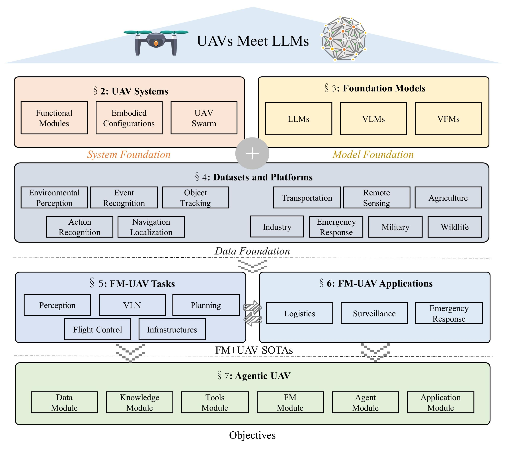

# 1 无人机遇见大模型：面向智能体低空移动性的综述与展望

## 摘要

低空移动性，以无人机（UAV）为例，已在交通、物流和农业等多个领域带来了变革性的进展。通过灵活的视角和快速的机动性，无人机扩展了传统系统的感知和行动能力，受到学术界和工业界的广泛关注。然而，目前的无人机操作主要依赖于人工控制，仅在简单场景中具备有限的自主性，缺乏在更复杂环境和任务中所需的智能和适应性。大型语言模型（LLMs）的出现展示了显著的问题解决和概括能力，为无人机智能的提升提供了有效的路径。本文探讨了 LLMs 与无人机的整合，首先概述了无人机系统的基本组成部分和功能，接着概述了 LLM 技术的最前沿进展。随后，系统性地强调了无人机可用的多模态数据资源，这些资源为训练和评估提供了关键支持。 此外，它对无人机与大型语言模型（LLMs）交汇的重要任务和应用场景进行了分类和分析。最后，提出了一条通向具备代理智能的无人机的参考路线图，旨在使无人机通过自主感知、记忆、推理和工具使用实现代理智能。

## 1  引言

无人机（UAV）的快速发展为智能交通、物流、农业以及工业检查等多个领域引入了变革性的监测和运输解决方案。凭借其灵活的空间移动性，无人机显著增强了智能系统的感知和决策能力，为升级传统系统和提高运营效率提供了一种强有力的方法。鉴于这些优势，无人机技术吸引了学术研究人员和行业从业者的广泛关注。

尽管无人机（UAV）具有巨大潜力，但目前大多数无人机仍依赖人类操作员进行飞行控制。这种依赖不仅带来了高昂的劳动成本，还引入了安全风险，因为操作员在评估环境条件时受到机载传感器的范围和灵敏度的限制。这些限制阻碍了无人机在复杂环境中的可扩展性和更广泛的应用。此外，由于运动自由度高以及对精确导航、障碍物避让和实时环境感知的需求，无人机的飞行控制本质上具有挑战性，这使得实现完全自主飞行的路径变得更加复杂。

最近在人工智能领域，尤其是基础模型（FMs）如 ChatGPT、SORA 以及各种人工智能生成内容（AIGC）框架的进展，促进了各行业的重大变革。大型语言模型（LLMs）具备接近人类的常识推理和概括能力，使其在多样化应用中能够实现高级理解、灵活适应和实时响应。将 LLMs 与无人机系统集成提供了一个有前景的途径，以增强自主性，为无人机提供先进的推理能力，并使其能够更有效地应对动态环境。

初步研究探讨了在导航 [[1], [2]]、感知 [[3], [4]]、规划 [[5], [6]] 等领域中将 LLMs 与 UAVs 相结合的可能性。这些早期努力突显了将 LLMs 与 UAV 系统结合以促进更复杂的自主行为的潜力。然而，关于 LLMs 和 UAVs 集成的系统评价仍然缺乏，特别是在支持这种跨学科融合的框架和方法论方面。为了推动对 UAV 与 LLM 集成的理解，本文提供了对现有框架和方法论的系统评审，提供了进一步推动这一跨学科融合的潜在路径的见解。本文的主要贡献如下。

1. 提供了无人驾驶飞机（UAV）与功能模型（FM）整合的全面背景，概述了无人驾驶飞机系统的基本组成部分和功能模块，以及典型功能模型的总结。此外，还详细列举了公开可用的数据集资源，强调了它们在支持智能无人驾驶飞机系统的发展、训练和评估中的关键作用。
2. 对最近有关 LLMs 与无人机整合的研究进行了全面审查，识别出导航、感知和规划任务等领域中的基本方法、多样化应用和关键挑战。
3. 提出了一种代理无人机的设计框架，概述了实现无人机自主感知、推理、记忆和工具使用所需的架构和能力，为其向更智能、更适应的系统发展铺平道路。

通过这些贡献，我们旨在提供关于无人机技术和 LLMs 交叉领域当前研究格局的基础概述，突出新兴趋势和挑战，并提出未来研究的方向。本次调查希望为希望利用 LLM 能力以推动无人机自主性并扩大无人低空移动系统应用潜力的研究人员和从业者提供参考。本文的组织结构如图 1 所示。无人机及基础模型（FMs）的系统知识从系统基础、模型基础和数据基础三个角度进行介绍。随后探讨无人机与 FMs 的融合，突出现有各类任务和应用中的最新技术（SOTAs）。最后，提出了自主无人机的架构，概述了未来发展的目标。

‍
