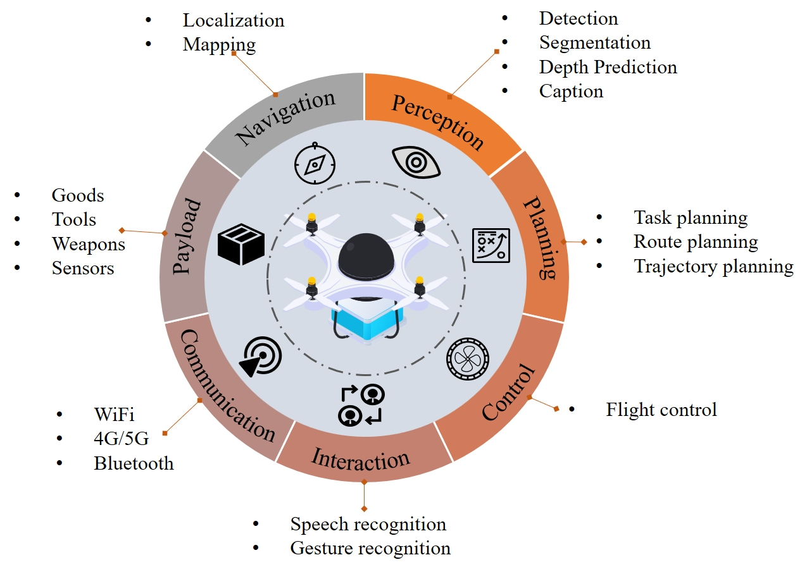

# 2  无人机系统的系统性概述

本节从功能模块和体现配置的角度提供了智能无人机的简要概述。功能模块涵盖了无人机系统的核心组件，包括感知模块、规划模块、通信模块、控制模块、导航模块、人机交互模块和载荷模块，突出了它们在无人机功能中的作用和贡献，如图 [2] 所示。体现配置方面侧重于无人机系统的结构特征，涵盖了固定翼无人机 [[7]]、多旋翼无人机 [[8], [9]]、无人直升机 [[10]] 和混合无人机 [[11]] 的设计与应用。此外，本节还集中讨论了无人机的群体智能，总结了无人机群体技术的进展，包括通信策略、编队控制方法和协作决策机制。

### 2.1  无人机的功能模块

#### 2.1.1  感知模块

感知模块作为无人机的“眼睛和耳朵”，通过多种机载传感器收集和解释数据，以构建对周围环境的全面理解。这些传感器包括 RGB 摄像头、基于事件的摄像头、热成像摄像头、3D 摄像头、激光雷达、雷达和超声波传感器 [[12]]。通过将原始传感器数据转换为可操作的见解，例如检测障碍物、识别地标和评估地形特征，感知模块提供了安全和自主飞行所必需的态势感知 [[13], [14]]。

除了基本的环境监测外，感知模块还支持多无人机操作中的协作任务，包括检测和跟踪其他无人机，以促进协调的群体行为。先进的计算机视觉和机器学习技术在这个过程中发挥着关键作用，提高了物体检测的准确性和鲁棒性 [[15], [16]]，语义分割 [[17], [18]] 和运动估计 [[19], [20]]。通常采用传感器融合方法来结合互补的数据源，例如，将激光雷达深度图与高分辨率相机图像融合，从而减轻单个传感器的局限性，同时利用它们独特的优势 [[21], [22]]。这一强大的多模态感知框架使无人机能够适应变化的条件（例如，改变的光照和动态环境），并在最小人类干预的情况下执行复杂任务。

#### 2.1.2  导航模块

导航模块负责将规划模块中的预定轨迹转化为精确的飞行路径，通过持续估计和调整无人机的位置、方向和速度 [[23]]。为了实现这一目标，它依赖于多种机载传感器 [[24]]，例如 GPS [[25], [26]]、惯性测量单元 [[27], [28]]、视觉里程计以及气压传感器或磁力计，以收集有关无人机状态的实时信息 [[29], [30]]。采用传感器融合算法，包括卡尔曼滤波器（例如扩展卡尔曼滤波器或无迹卡尔曼滤波器）和粒子滤波器，来整合来自不同来源的数据，从而增强状态估计的可靠性和准确性。

在 GPS 缺失或复杂环境中，导航模块可以采用同时定位与地图构建技术或视觉 SLAM 来提供可靠的定位和环境映射 [[31], [29], [32], [33], [34]]。这些先进的解决方案使无人机能够在传统卫星定位不可用或不可靠的情况下维持较高的情境意识。通过确保准确的状态估计和顺畅的轨迹跟踪，导航模块在保持整体飞行稳定性和确保无人机在整个操作时间内遵循任务计划方面发挥着关键作用。

#### 2.1.3  规划模块

规划模块在将高层次任务目标转化为具体的飞行轨迹和行动中至关重要，依赖于感知模块的输入以确保安全导航 [[35], [36]]。路径规划算法涵盖了一系列广泛的技术，旨在计算围绕障碍物的可行且通常是优化的路线。这些方法包括启发式算法，例如 A∗A\* 算法 [[37]]，进化算法 [[38]]，模拟退火 [[39], [40]]，粒子群优化 [[41], [42], [43]]，鸽子启发优化 [[44]]，人工蜂群 [[45], [46]] 等。机器学习方法，包括神经网络 [[47], [48], [49]]，以及深度强化学习 [[50], [51]]，也被用于更适应性和数据驱动的规划。 此外，基于采样的策略，如快速扩展随机树，为处理高维或动态变化环境提供了灵活的框架 [[52]]。通过利用其中一种或多种方法，无人机能够制定安全、无碰撞的轨迹，优化关键性能指标，如旅行时间、能量消耗或整体任务效率 [[53], [54], [44], [55]]。这些技术使无人机能够在复杂或不确定的环境中自主操作，通过实时不断调整其规划路径，特别是在地形、障碍物位置或任务参数发生意外变化时，这一点尤为重要。

在多无人机或群体作战中，规划模块在协调各个无人机的飞行路线方面发挥着关键作用，确保避免碰撞并维持一致的群体行为 [[56], [57], [58]]。这种协作规划能力不仅提高了任务效率，还降低了无人机之间干扰的风险。通过动态更新轨迹和共享相关信息，规划模块支持与整体任务目标相一致的强大、可靠的操作。

#### 2.1.4  控制模块

控制模块负责生成低级命令，以调节无人机的执行机构，包括电动机、伺服和其他控制面，保持稳定和响应迅速的飞行。作为系统的“肌肉”，它持续调整关键参数，如高度、速度、方向和姿态，以响应来自机载传感器的实时反馈。通过与导航和规划模块提供的参考输入闭合控制回路，控制模块确保无人机遵循期望的飞行动轨迹和任务目标 [[59], [60]]。

为了管理潜在的干扰（例如，风 gusts、载荷变化）并补偿建模不确定性，采用了多种经典和现代控制策略。传统方法，如比例-积分-微分控制 [[61], [62]]，提供了简单性和易于实现的优点，而更先进的技术如模型预测控制则能够基于系统动态和约束进行预测性操作。自适应控制方法通过实时调整控制参数来进一步提升性能，以适应系统特性的演变 [[63], [64]]。其他强健策略，如滑模控制或非线性控制，可以在特别具有挑战性的操作条件下使用，提供对传感器噪声和突发环境变化的韧性 [[65], [66]]。

在多旋翼无人机中，例如，控制模块精细调节各个电机的速度，以实现稳定飞行所需的适当推力和扭矩分布，而在固定翼平台中，控制模块则操控空气动力学表面以维持或改变飞行路径 [[67], [68], [69]]。传感器反馈、控制算法和执行器指令的紧密集成使无人机能够快速响应偏差和外部干扰，确保在整个任务中平稳可靠的操作。

#### 2.1.5  通信模块

通信模块支撑着无人机、地面控制站及其他外部实体（如卫星、边缘设备或云服务）之间的所有数据交换，确保关键遥测、控制和有效载荷信息的无缝流动。典型的通信方法包括短距离的无线电频率系统和 Wi-Fi 链接，以及更复杂的长距离网络，如 4G、5G，甚至卫星连接，每种方法都是为满足特定任务需求而选择的，考虑的因素包括带宽、延迟和范围 [[70], [71], [72], [73]].

在无人机群作战中，通信模块变得尤为关键，它负责在地面控制与无人机之间转发命令，并通过实时共享情境数据（例如位置、传感器读数）来促进无人机之间的协调 [[73], [74]]。强健的通信协议通常结合加密和认证机制，以防止未经授权的访问和恶意干扰，而自适应信道选择和多跳临时路由等技术可以减轻信号衰减，并在动态环境中确保可靠的连接 [[75]]。通过管理和优先处理不同的数据流（遥测、有效载荷、指挥与控制），通信模块充当保持所有子系统同步的支柱，并支持无人机的整体操作目标 [[76]]。

#### 2.1.6  交互模块

交互模块旨在促进无人航空器（UAV）与人类操作员或操作环境中其他代理之间的无缝沟通与协作 [[77], [78]]。它包括可能包含语音命令、手势识别、增强或虚拟现实显示器或基于触摸屏的数据可视化系统的用户界面和交互范式 [[79], [80], [81], [82], [83]]。此外，采用自适应用户界面设计方法，可以根据操作员的技能水平和工作负载量身定制显示信息，或采用触觉反馈机制为关键事件提供触觉警报，这能进一步增强情境意识和用户体验 [[84]]。这些接口使地面人员能够发出高级命令、审核任务进展，并在必要时进行干预，从而确保操作员保持监督和决策权 [[85]]。

在群体或多无人机的上下文中，交互模块变得更加重要。它不仅允许中央决策者协调多个无人机，还使人类操作员能够从整个群体中接收汇总的情境数据，可能实时标记异常或新出现的行为。这些人类与无人机的交互渠道在协作任务（例如，搜索救援、环境监测或基础设施检查）中尤为关键，在这些任务中，可能需要即时指导或反馈以调整无人机的行为以适应不断变化的条件 [[86], [87], [88]]。通过提供强大的手动覆盖和实时通信机制，交互模块在自主操作和人类监督之间取得了平衡，从而提升了任务的有效性和操作安全性 [[87], [89], [90]]。

#### 2.1.7  有效载荷模块

载荷模块负责监督无人机携带的设备或货物，以实现其任务目标。根据任务的不同，这些载荷可能包括用于监视的摄像头、送货包裹、用于环境监测的先进传感器，以及用于搜索和救援等任务的专用硬件 [[91]]。因此，载荷模块必须满足各种操作需求，包括电源供应、安全数据传输、机械支持和适当的稳定性，以确保在不同条件下的可靠性能 [[59], [92]]。

在实际应用中，这个模块通常集成了诸如振动阻尼、热管理和安全安装解决方案等功能，以保护精密组件并保持飞行过程中的最佳功能。此外，在某些无人机设计中，载荷模块被设计为可互换的。这种模块化的方法通常采用标准化的安装和连接接口，使得载荷的快速更换成为可能，并简化了为不同任务配置无人机的过程。因此，操作人员可以在不需要全新平台的情况下扩展无人机的能力，从而提高灵活性，减少部署时间和成本 [[93], [94], [95], [96]]。

总体而言，载荷模块在将无人机的核心飞行系统与实现操作目标所需的特定任务工具之间架起了关键桥梁。通过适应各种载荷并确保其供电、保护和高效连接，载荷模块显著扩展了无人机在各个行业和任务类型中的适用性。

### 2.2  无人机的体现配置

无人机可以根据其几何构型分为几种类型。这些类型包括固定翼无人机、多旋翼无人机、无人直升机和其他类型。下面，我们介绍这些类型并总结它们的特征。

#### 2.2.1  固定翼无人机

固定翼无人机具有预定的机翼形状，当空气流过机翼时产生升力，从而实现前进运动 [[92]]。这些无人机以其高速、长续航和稳定飞行为特点，非常适合长时间的任务。然而，它们需要先进的飞行技巧，不能进行悬停 [[97]]。固定翼无人机通常用于监测田野、森林、高速公路和铁路 [[92]]。

#### 2.2.2  多旋翼无人机

多旋翼无人机是日常生活中最常见的类型之一，通常配备多个旋翼（通常为四个、六个或更多）通过旋翼旋转产生升力。它们的优点包括低成本、操作简单以及垂直起降（VTOL）和悬停能力，使其适合进行精确任务。然而，它们的续航能力有限且速度相对较低。多旋翼无人机通常用于摄影、农业监测和喷洒等任务。

#### 2.2.3  无人直升机

无人直升机配备有一到两个动力旋翼，以提供升力并实现姿态控制。这种设计允许垂直起飞、悬停和高机动性。与多旋翼无人机相比，无人直升机具有更高的载荷能力，使其能够携带更重的设备或传感器。它们的优势包括长时间续航和优异的抗风能力，即使在强风中也能保持稳定。主要的限制是相对较低的速度。无人直升机在交通监控、资源勘探、森林防火和军事侦察等领域得到广泛应用。

#### 2.2.4  混合型无人机

混合型无人机结合了固定翼和多旋翼无人机的优点，提供了一种多功能设计，既能垂直起降，又能实现固定翼无人机特有的长续航和高速。这些无人机通常采用旋翼进行垂直飞行时的升力，并配备机翼以实现持续的前向运动。混合型无人机的主要优势在于其灵活性，使其能够执行各种任务，包括需要悬停和长时间飞行的任务。然而，其设计和机制的复杂性导致了更高的成本和更苛刻的维护要求。

#### 2.2.5  振翅无人机

拍翼无人机是受到生物启发的无人飞行器，模仿鸟类或昆虫的飞行机制。这些无人机依赖于翼拍打产生的不稳定气动效应来实现飞行。与传统无人机相比，它们提供了更安静的操作、更高的效率和更强的机动性。它们紧凑的尺寸是一个显著优势，但通常具有较低的有效载荷能力。此外，由于飞行动力学的动态特性，拍翼无人机的设计和控制系统更为复杂。

#### 2.2.6  无人飞艇

无人飞艇是一种空中载具，利用轻质气体提供浮力，并采用推进系统和外部结构元件进行移动和方向控制。这些飞艇具有高性价比并且产生低噪音飞行。然而，它们的灵活性有限，速度相对较低。由于其体积较大，无人飞艇对风的影响非常敏感，这可能会影响其稳定性和操作可靠性。

表 1： 无人机的典型配置

|**类别**|**特点**|**优势**|**劣势**|
| --------------| ------------------------------------| --------------------------------------------------| --------------------------------------------------|
|固定翼无人机|固定翼通过前进运动产生升力。|高速、长续航、稳定飞行。|无法悬停，对起降区域要求较高。|
|多旋翼无人机|多个旋翼提供升力和控制。|低成本，操作简单，能够垂直起降和悬停。|有限的飞行时间，低速，小有效载荷。|
|无人直升机|单旋翼或双旋翼允许垂直起飞和悬停。|高有效载荷，良好的抗风性，长续航时间，垂直起降。|复杂结构，较高的维护成本，速度慢于固定翼无人机。|
|混合无人机|结合了固定翼和多旋翼的能力。|灵活的任务，长时间的耐久性，垂直起降。|复杂的机制，更高的成本。|
|拍动翼无人机|采用拍击和抛掷机制进行飞行。|低噪音、高推进效率、高机动性。|复杂的分析和控制，有限的载荷能力。|
|无人飞艇|气球式飞行器利用气囊提供升力。|低成本，低噪音。|低速，低机动性，受风影响较大。|

### 2.3  无人机蜂群

无人机群涉及多个无人机协同工作以实现共同目标，相较于单一无人机操作，这种方式在冗余性、可扩展性和效率方面具有优势 [[98]]。群体方法依赖于分散的决策制定，使无人机能够根据同伴的行为和环境变化调整其行为。群体算法常常受到生物系统的启发 [[99]]，如鸟群或蚂蚁群落，利用共识算法 [[100]]、粒子群优化 [[101]] 或基于行为的协调 [[102]] 等技术。有效的群体操作需要无缝通信、强健的控制机制和协作规划，以管理分布式系统的复杂性 [[103]]。这一概念在大面积监控、精准农业和搜索救援等应用中尤为有用，其中多个无人机可以比单一载具更有效地覆盖更大区域。

在本节中，我们将讨论有效无人机群体操作所必需的关键组成部分，包括任务分配、通信架构、路径规划和队形控制。

#### 2.3.1  无人机群中的任务分配

无人机群可以被视为一个执行特定任务的团队，团队内由一组任务构成，成员之间需要负责任务的分配 [[104]]。任务分配是无人机群作战中最重要的问题之一，因为它直接影响任务的效率。已经证明，寻找任务分配问题的最优解是 NP-hard 问题，且随着无人机群规模和任务数量的增加，难度呈指数增长 [[105]]。通常，无人机群任务分配问题被建模为旅行商问题（TSP）[[106]] 或车辆路径问题（VRP）[[107]]，混合整数线性规划（MILP）模型 [[108]]，或合作多任务分配问题（CMTAP）模型 [[109]]。常用的算法包括启发式算法、基于人工智能的方法、数学规划方法和基于市场机制的算法。

常用的启发式算法用于任务分配问题，包括遗传算法（GA）、粒子群优化（PSO）和模拟退火（SA）等。这些算法使用随机搜索方法来寻找可行解，防止问题陷入局部最优解。遗传算法通过交叉和变异策略生成随机解，然后通过选择最佳候选者迭代改进这些解。最终，它们会收敛到接近最优解的解。例如，Han 等人 [[110]] 提出了一种模糊精英策略遗传算法（FESGA），以高效解决复杂的任务分配问题。Yan 等人 [[111]] 提出了一种改进的遗传算法，以解决多个无人机攻击多个目标时的集成任务分配和路径规划问题。

PSO 平衡探索和开发过程，并迭代产生接近最优的解决方案。该算法易于实施，速度快，并广泛应用于任务分配问题。Jiang 等人 [[112]] 提出了一种改进的 PSO 算法，以解决多约束任务分配问题，该算法适合于解决复杂的组合优化问题。由于大多数研究将多无人机任务分配视为单目标优化问题，Gao 等人 [[113]] 应用了一种改进的多目标 PSO（MOPSO）算法来解决多个无人机的任务分配问题。

数学规划方法的优势在于找到精确的最优解决方案，但随着问题规模的增长，其求解时间呈指数级增加。Choi 等人 [[114]] 将多个无人机在多个目标上执行任务的任务分配问题建模为混合整数线性规划（MILP）模型以寻求解决方案。

基于人工智能的方法，如强化学习和人工神经网络，在提取环境特征方面具有优势。杨等人 [[115]] 提出了一种基于强化学习的任务调度算法，使无人机能够根据其任务绩效效率计算动态调整任务策略。尹等人 [[116]] 将深度迁移强化学习应用于多无人机任务分配问题。

基于市场机制的方法是任务分配的经典分布式方法，包括基于拍卖的算法和合同网协议（CNP）算法 [[117]]。这些方法利用激励机制鼓励代理参与任务分配过程，代理根据任务的效用或成本进行竞标，旨在最大化效用或最小化成本。这些方法的主要优点是计算效率高 [[118]]。Qiao 等 [[119]] 应用了一种拍卖算法用于动态无人机任务分配，解决了多约束、多无人机的动态任务分配问题。Duan 等 [[120]] 提出了一种具有层次化决策机制和改进目标函数的混合“二阶段”拍卖算法，该算法通过在资源约束下同时实现异构任务分配和障碍规避，提升了多无人机动态任务分配的性能。该算法在效率和鲁棒性方面优于许多最先进的模型。 张等人 [[121]] 开发了一种多约束模型，以进行动态多无人机任务调度，重点在于最大化总任务利润、最小化时间消耗以及平衡无人机之间的任务分配。他们引入了一种基于混合合同网协议的任务调度方法，包括买卖、互换和替换合同。王等人 [[122]] 提出了一种基于合同网协议的两阶段分布式任务分配算法（TS-DTA），有效解决了动态环境中的任务重新分配问题。

#### 2.3.2  无人机群的通信架构

对于无人机群，通信对于协作、促进合作工作和维持操作期间的稳定性至关重要。通信主要可以通过两种方法实现：基于基础设施的架构 [[123]] 和飞行自组网（FANET）架构 [[124]]。每种方法都有其独特的优势和挑战，下面将进行讨论。

基于基础设施的架构：该架构依赖于地面控制站（GCS）[[70]] 来管理无人机群。GCS 从无人机收集遥测数据并传输指令，既可以实时进行，也可以通过预编程的指令进行。其主要优点包括集中计算和实时优化，消除了对无人机间通信网络的需求 [[123]]。然而，这种方法也有显著的局限性：整个系统对 GCS 的单点故障非常脆弱，无人机必须保持在 GCS 通信范围内，并且该架构缺乏分布式决策的灵活性 [[123]]。

飞行自组网络（FANET）架构：FANET 由无人机直接相互通信组成，无需中央接入点。这个分散的网络使无人机能够自主协调任务，至少有一架无人机与地面基地或卫星保持连接。FANET 具有灵活性、可扩展性和对基础设施依赖性降低的优点。然而，它们需要强健的通信协议，并可能面临动态拓扑管理和确保可靠性方面的挑战 [[124]]。

#### 2.3.3  无人机集群的路径规划

无人机集群路径规划是指从起始位置到所有目标位置为无人机集群选择一条最佳路径，同时确保无人机之间保持预定距离以避免碰撞 [[125]]。最佳路径通常指的是最短路径长度、最短旅行时间、最少能耗以及其他事件特定约束条件 [[125]]。最佳路径的标准需要根据实际问题进行确定。无人机路径规划算法一般可以分为三大类：智能优化算法、数学规划方法和基于人工智能的方法。下面，我们简要介绍这三种方法。

在自然界中，各种集体行为，如鸟群、鱼群和蚂蚁群落，遵循特定规则，使得高效的觅食或迁徙成为可能。这些行为可以抽象为用于信息传递、路径规划和协调控制的数学模型，适用于无人机群体调度。无人机群体的常见智能优化算法包括蚁群优化（ACO）、遗传算法（GA）、模拟退火（SA）和粒子群优化（PSO）。例如，ACO 模仿蚂蚁的觅食行为，蚂蚁根据信息素浓度以概率选择路径，最终找到最优或近似最优解。研究人员如 Turker 等人 [[126]] 已将 SA 应用于无人机群体路径规划，而 Wei 等人 [[127]] 则使用 ACO 达成同样目的。

除了受自然启发的启发式算法外，像混合整数线性规划（MILP）和非线性规划这样的数学模型也可以直接应用于无人机（UAV）集群调度，以提供精确的解决方案。例如，Ragi 等人 [[128]] 使用混合整数非线性规划（MINLP）来解决无人机路径规划的问题。虽然这些方法对小规模问题有效，但随着问题规模的增长，它们的计算复杂性呈指数级增加。

随着机器学习的兴起，基于人工智能的算法也被应用于无人机群的调度和优化。Kool 等人 [[129]] 使用深度学习进行车辆路径规划，类似的方法也被采用在无人机群的路径规划中。Xia 等人 [[130]] 将神经网络应用于无人机路径规划，Sanna 等人 [[131]] 将其扩展到多无人机的规划，而 Puente-Castro 等人 [[54]] 则应用了强化学习。通过在广泛的数据集上进行训练，神经网络能够学习建模环境，包括障碍物及其动态变化，从而提高路径规划的准确性。

#### 2.3.4  无人机群编队控制算法

无人机群依赖于有效的编队控制算法，使其能够自主形成和维持编队以执行任务，并根据特定任务进行编队切换或重建 [[132]]。编队控制的主要方法包括集中控制、分散控制和分布式控制算法 [[133]]。

集中控制：集中控制涉及一个中心单元，负责任务分配和资源管理，各个无人机主要负责数据的输入、输出和存储 [[132]]。这种方法简化了决策过程，确保了协调行动，且相对易于实现。然而，它容易受到较高的通信开销和单点故障的影响；如果中心单元出现故障，整个系统可能崩溃。集中控制中的常见方法包括虚拟结构 [[134]] 和领导-跟随方法 [[135], [136]]。

去中心化控制：在去中心化控制中，每个无人机根据本地传感器和控制器做出决策，无需与其他无人机进行明确的通信 [[137]]。无人机根据本地条件和预定义规则调整其运动以保持编队。该方法的主要优点包括灵活性和适应编队的容易性。然而，缺乏对全球信息的访问导致控制性能较差，需要持续迭代 [[138]]。

分布式控制：分布式控制涉及无人机之间的广泛通信，使它们能够通过共享信息进行协调并保持队形。无人机协同工作，基于局部数据和预设规则做出最佳决策。与分散控制相比，分布式控制在更强的协作性和更好的灵活性方面具有优势。然而，它需要更高的通信需求和更复杂的算法来管理协调，这增加了计算负担和通信故障的风险。典型的方法包括行为方法 [[139]] 和一致性方法 [[140]]。

‍
