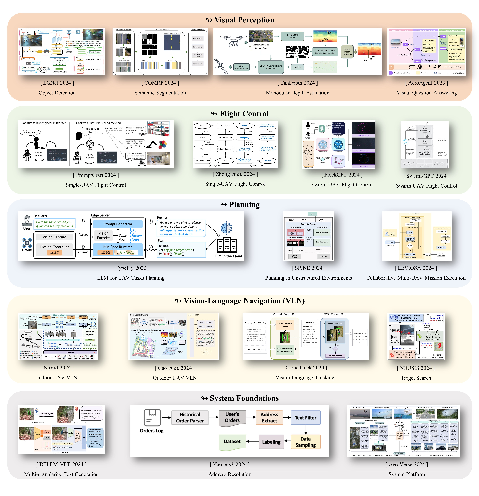

# 5  基于基础模型的无人机系统的进展

将人工智能算法，如机器学习和深度学习，整合到无人机系统中已成为一种主流趋势。然而，在无人机任务中应用传统人工智能模型仍面临许多挑战。首先，这些模型通常依赖于特定任务的数据集进行训练，因此在实际场景与训练分布之间存在显著差异时，泛化能力不足和鲁棒性差。此外，传统人工智能模型通常是针对单一任务进行优化的，使它们在应对多任务协作的复杂需求时效果不佳。此外，这些模型在人机交互和任务协作方面存在明显的局限性 [[309], [310], [311]]。

LLMs、VFMs 和 VLMs 的引入通过自然语言理解、零-shot 自适应、多模态协作和直观的人机交互为无人机系统注入了新颖的智能能力。

本节探讨了将 LLMs、VFMs 和 VLMs 整合到无人机系统中的现有研究，并分析了这些技术为不同任务带来的优势。图 [4] 中展示了几个典型的工作。根据技术类型和任务特征，无人机相关任务被分类为以下几种类型：

- 1. **视觉感知：**  这些包括对象检测、语义分割、深度估计、视觉描述和视觉问答（VQA）。此类任务侧重于环境感知和语义信息提取，为无人机系统中的高层决策提供基础。
- 2. **视觉-语言导航（VLN）：** VLN 代表了计算机视觉和自然语言处理深度集成的典型应用。在 VLN 任务的基础上，开发了更复杂的多模态任务，例如视觉-语言跟踪（VLT）和目标搜索。这些任务整合了多个组件，包括感知、规划、决策、控制和人机交互，构成了无人机智能任务执行的核心框架。
- 3. **规划：**  这包括路径优化、任务分配和动态环境中的自适应任务优化。
- 4. **飞行控制：**  这些涉及低层控制任务，如姿态稳定、路径跟踪和避障。
- 5. **基础设施：**  这主要集中在为无人机系统提供全面的技术和数据支持，包括集成框架和平台的开发，以及高质量数据集的创建和处理。这些努力不仅提高了无人机在多模态任务中的应用效率，还为无人机领域的基础研究和技术创新提供了重要支持。

我们在表 [10] 中系统地比较了相关方法，以提供对这一快速发展的领域的高层次概述。需要注意的是，表 [10] 中的“基础模型”列在某些情况下缺少具体的模型名称（例如，GPT、LLM），因为原始参考文献未指定确切的模型版本。对于某些模型，引用了参考文献，因为在第 [3] 节中未提供模型的详细描述。此外，符号“LLMs 或 VLMs”表示在相应的方法中测试了多种类型的基础模型。

表 10： 基于 FM 的无人机系统在各种任务中的进展

|**类别**|**子类别**|**方法 / 模型名称**|**类型**|**基础模型**|
| ----------| ---------------| --------------------| -------------| ----------------------------------------------|
|视觉感知|目标检测|Li​ *等* ​[[312]]|VFM|CLIP|
|||马​ *等* ​[[313]]|VFM|Grounding DINO + CLIP|
|||林伯格​ *等* ​[[314]]|VFM+VLM|YOLO-World + GPT-4V|
|||金​ *等* ​[[315]]|VLM+VFM|LLaVA-1.5 + CLIP|
|||LGNet[[3]]|VFM|CLIP|
|||[[316]]|VLM+VFM|BLIP-2 + OvSeg[[317]]+ ViLD[[318]]|
||分割|COMRP[[313]]|VFM|Grounding DINO + CLIP + SAM + DINOv2|
|||CrossEarth[[319]]|VFM|DINOv2|
||深度估计|TanDepth[[320]]|VFM|深度任何东西|
||视觉说明/问答|DroneGPT[[4]]|VLM+LLM+VFM|VISPROG + GPT-3.5 + Grounding DINO|
|||de Zarzà​ *等* ​[[321]].|LLM|BLIP-2 + GPT-3.5|
|||AeroAgent[[322]]|VLM|GPT-4V|
|||RS-LLaVA[[323]]|VLM|LLaVA-1.5|
|||GeoRSCLIP[[324]]|VFM|CLIP|
|||SkyEyeGPT[[325]]|VFM+LLM|EVA-CLIP + LLaMA2|
|VLN|室内|NaVid[[326]]|VFM+LLM|EVA-CLIP + Vicuna|
|||VLN-MP[[327]]|VFM|Grounding DINO / GLIP|
||户外|高​*等* ​[[328]]|VFM+LLM|Grounding DINO + TAP + GPT-4o|
|||MGP[[267]]|LLM+VFM|GPT-3.5 + Grounding DINO + MobileSAM|
|||UAV 导航 LLM[[329]]|LLM+VFM|Vicuna + EVA-CLIP|
|||GOMAA-Geo[[2]]|LLM+VFM|LLMs + CLIP|
|||导航智能体[[1]]|LLM+VFM+VLM|GLIP + BLIP-2 + GPT-4 + LLaMA2|
|||自适应多目标算法[[330]]|LLM+VFM|GPT-2 + CLIP|
|||张​ *等* ​[[331]]|VFM+LLM|GroundingDINO + LLM|
|||陈​ *等* ​[[332]]|LLM|GPT-3.5|
||跟踪|云轨迹[[333]]|VFM+VLM|Grounding DINO + VLMs|
||目标搜索|NEUSIS[[334]]|VFM+VLM|HYDRA + CLIP + Grounding DINO + EfficientSAM|
|||Say-REAPEx[[335]]|LLM|GPT-4o-mini / Llama3 / Claude3 / Gemini|
|规划|\_|类型飞行[[5]]|LLM|GPT-4|
|||脊柱[[336]]|LLM+VFM+VLM|GPT-4 + Grounding DINO + LLaVA|
|||勒维奥萨[[337]]|LLM|Gemini 1.5 / GPT-4o|
|||TPML[[338]]|LLM|GPT / 彭城智脑[[339]]|
|||真实[[6]]|LLM|GPT-4|
|||刘​ *等* ​[[340]]|LLM|GPT-4|
|飞行控制|单一代理|PromptCraft[[341]]|LLM|GPT|
|||钟​*等* ​[[342]]|LLM|GPT|
|||塔齐尔​*等* ​[[343]]|LLM|GPT-3.5|
|||法德克​*等* ​[[344]]|LLM|\_|
|||EAI-SIM[[345]]|LLM|GPT / 彭城智能[[339]]|
|||TAIiST[[346]]|LLM|GPT-3.5|
||群体|群体-GPT[[347]]|LLM|GPT-3.5|
|||FlockGPT[[348]]|LLM|GPT-4|
|||CLIPSwarm[[349]]|VFM|CLIP|
|基础设施|\_|DTLLM-VLT[[350]]|VFM+LLM|SAM + 鹰栖 + LLaMA / Vicuna|
|||姚​*等* ​[[271]]|LLM|GPT-3.5 / ChatGLM|
|||GPG2A[[351]]|LLM|双子座|
|||航空宇宙[[352]]|VLM+LLM|VLMs + GPT-4|
|||唐​*等* ​[[353]]|LLM|\_|
|||徐​ *等* ​[[354]]|LLM|\_|
|||LLM-RS[[355]]|LLM|ChatGLM2|
|||Pineli​ *等* ​[[356]]|LLM|LLaMA3|

### 5.1  视觉感知

#### 5.1.1  目标检测

传统的目标检测算法在无人机应用中面临重大挑战。无人机的飞行高度和视角的变化导致视野的变化，使得多尺度目标检测成为关键研究焦点 [[357], [358], [359]]。然而，动态环境条件、多样化拍摄场景和不可预测性进一步增加了检测任务的复杂性 [[360], [361]]。此外，不同场景的特定领域特征使模型在多样化环境中实现稳健泛化变得困难。为了解决这些挑战，一些研究尝试通过改进训练策略来增强模型的鲁棒性，例如为特定无人机场景训练专用模型或引入多任务学习框架 [[362], [363], [364]]。然而，这些方法通常会产生高昂的训练成本，并且在泛化能力上仍然存在局限性。 此外，传统的监督学习方法严重依赖大量手动标记的数据，进一步增加了与数据集构建相关的时间和资源成本。

从更高的角度来看，传统的基于边界框的目标检测方法主要关注对象的几何特征，缺乏建模上下文信息的能力。这种离散的低级特征表示难以捕捉复杂的语义信息，限制了它们在高层次任务中的潜力。自然语言的引入为无人机目标检测任务开辟了新的途径。自然语言与视觉的结合利用了它们的互补优势。凭借视觉语言模型（VLMs）和视觉特征模型（VFMs）的灵活性、零样本学习能力、上下文理解以及强泛化性能，这些模型能够有效应对复杂任务，并通过多模态整合显著提高无人机目标检测的准确性和适应性。

在特定应用中，Li  *等*  [[312]] 将 CLIP [[186]] 与传统目标跟踪模块结合，以实现无人机的自然语言跟踪（TNL）任务。Ma  *等*  [[313]] 通过整合 Grounding DINO [[192]] 和 CLIP，增强了无人机图像中道路场景检测的准确性。Limberg  *等*  [[314]] 利用 YOLO-World [[196]] 和 GPT-4V [[167]] 的组合，实现了无人机图像中的零样本人类检测和动作识别。Kim  *等*  [[315]] 使用 LLaVA-1.5 [[170]] 通过将视觉特征与天气和光照等语言提示相结合，为无人机图像生成天气描述。通过使用 CLIP 编码器，他们将图像特征与天气相关信息融合。 基于这一框架，实施了天气感知物体查询，有效利用天气信息进行物体检测任务，从而显著提高了检测精度和鲁棒性。

值得注意的是，CLIP 的多模态表示能力能生成高质量的领域不变特征，为传统物体检测模型的训练提供强有力的支持。例如，LGNet [[3]] 引入了 CLIP 的多模态特征，显著增强了在多样拍摄条件下无人机物体检测的鲁棒性和性能。此外，LLMs、VLMs 和 VFMs 在一般物体检测任务中积累了丰富的研究经验，为无人机物体检测任务提供了重要的见解。相关例子包括 LLM-AR [[365]]、Han  *等*  [[366]]、Lin  *等*  [[367]]、ContextDET [[368]] 和 LLMI3D [[369]]。

然而，仅依靠 VFMs 或 VLMs 进行物体检测可能会在某些场景中由于模型幻觉或任务特定适应性不足而导致性能限制 [[370], [371], [372]]。虽然传统深度学习模型在特定任务中表现可靠，但它们缺乏跨任务泛化能力。更好的解决方案是采用“大型模型 + 小型模型”的协同架构，利用大型模型的强泛化能力和小型模型的领域专业化。例如，Hidetomo Sakaino 视觉识别组 [[316]] 提出了一种将深度学习模型与 VLMs 相结合的方法，用于可见度和天气条件估计。该方法有效地解决了图像处理中的诸如尺度变化、视角变化和环境干扰（包括天空背景干扰和远距离小物体检测）等挑战。它在各种环境和天气条件下展现了卓越的鲁棒性和稳定性。

#### 5.1.2  语义分割

作为一种计算机视觉任务，UAV 语义分割面临许多与目标检测相似的挑战，例如，由对抗性视觉条件引起的不足的泛化能力以及对手动标注数据的高度依赖。此外，UAV 遥感图像在语义分割任务中遇到复杂的前景-背景交互，涉及多尺度场景，这在该领域提出了独特的挑战 [[373], [374]]。尽管领域适应（DA）技术已广泛应用于跨域语义分割，但这些方法主要迫使模型从源域调整到预定义的目标域。然而，这些方法对未见域的泛化能力有限，突显了在多样化场景中提升模型性能的迫切需要更灵活和鲁棒的策略 [[375], [376]]。

VLMs 和 VFMs 的引入为无人机语义分割任务注入了新的技术动力。这些模型能够高效地执行零-shot 语义分割，同时通过自然语言交互灵活地定义和指导分割任务，展现出满足多样化场景需求的卓越潜力。例如，COMRP [[313]] 专注于解析高分辨率无人机图像中的道路场景。其方法首先利用 Grounding DINO [[192]] 和 CLIP [[186]] 提取与道路相关的区域，并使用 SAM [[198]] 自动生成分割掩膜。然后，使用 ResNet [[377]] 和 DINOv2 [[193]] 提取特征，并通过谱聚类方法对掩膜特征向量进行聚类以生成伪标签。这些标签用于训练教师模型，迭代优化学生模型的性能。COMRP 消除了对人工标注的依赖，为无人机道路场景解析提供了一种高效和自动化的解决方案。

此外，CrossEarth [[319]] 是一种针对遥感领域设计的跨领域泛化语义分割 VFM。它结合了两种互补策略：地球风格注入和多任务训练，显著增强了跨领域泛化能力。地球风格注入将来自地球领域的多种风格融入源领域数据，扩展了训练数据的分布范围。多任务训练利用共享的 DINOv2 主干网络，同时优化语义分割和掩膜图像建模任务，从而能够学习到稳健的语义特征。

#### 5.1.3  深度估计

无人机感知系统的核心功能之一是对地形和自然环境进行三维建模，从而生成飞行区域的一致且准确的三维几何表示。近年来，基于神经辐射场（NeRF）和三维高斯喷溅（3DGS）的方法在这个任务上取得了显著进展，例子包括 UAV-NeRF [[378]] 和 AGS [[379]]。然而，这些方法在大规模场景中仍面临诸多挑战。在此背景下，单目深度估计（MDE）逐渐成为一种更有优势的解决方案 [[380], [381], [382]]。

Florea  *等*  [[320]] 提出了 TanDepth 框架，该框架结合了 Depth Anything[[215]] 模型的相对深度估计与全球数字高程模型（GDEM）数据，采用尺度恢复方法生成具有真实世界尺寸的高精度深度图像。对多个无人机数据集的实验结果表明，TanDepth 在复杂地形和动态飞行环境中展现出卓越的准确性和鲁棒性。这一方法为无人机深度估计任务开辟了新的技术方向，特别展示了其在缺乏高精度深度传感器的场景中的效率和适应性。

#### 5.1.4  视觉标题和视觉问答

视觉标题和视觉问答属于计算机视觉与自然语言处理的跨模态融合领域，侧重于图像和视频内容的语义理解及自然语言表示。传统方法通常基于深度学习框架，其中视觉特征提取和语言生成被设计为独立模块。然而，这种分离设计在复杂场景、开放领域问题和细粒度描述生成中存在显著限制，主要受到模型表达能力和多模态特征不对齐的约束 [[383], [384], [385], [386]]。随着视觉语言模型（VLMs）和视觉特征模型（VFMs）的快速发展，这些模型利用视觉和语言的联合表示学习来显著增强对复杂跨模态信息的理解。 预训练于大规模多模态数据集的 VLM 和 VFM 展示了卓越的任务泛化能力，并能够在复杂场景中生成细致的语义描述，展现出对开放领域任务的高度适应性 [[169], [174], [175], [176], [180], [185]]。

在无人机视觉标注和视觉问答任务中，研究主要集中在两个方向：第一是根据特定的无人机需求，选择或结合现有的视觉语言模型（VLMs）和视觉功能模型（VFMs），使其适应无人机任务场景；第二是对 VLMs 或 VFMs 进行领域特定数据的训练或微调，以构建适用于无人机垂直应用的专业模型，解决独特的挑战。这些研究方向旨在进一步增强无人机在复杂环境中的视觉感知、语义推理和任务执行能力，为智能且用户友好的人机交互提供强有力的支持。

对于第一个研究方向，几项研究探讨了将现有的视觉语言模型（VLMs）和视觉功能模型（VFMs）结合，以适应无人机（UAV）场景。例如，邱等人 ​*et al*​. [[4]] 提出了基于视觉推理模型 VISPROG [[185]] 的 DroneGPT 框架，其中 GPT-3.5 [[141]] 将用户的自然语言查询转换为任务逻辑代码。这些代码调用 Grounding DINO [[192]] 解析视觉信息并执行语义推理，最终输出清晰准确的视觉问答结果。De Zarzà ​*et al*​. 设计了一个将 BLIP-2 [[176]] 与 GPT-3.5 结合的框架，以实现高效的无人机视频场景理解和语义推理，其中 BLIP-2 从每个视频帧中提取初步的语义信息，而 GPT-3.5 生成高级场景描述。AeroAgent 架构 [[322]] 从代理的角度优化无人机视觉问答模块。 基于 GPT-4V [[167]]，它构建了一个可检索的多模态记忆数据库（类似于 RAG 框架），显著提高了复杂场景下的理解和回答准确性，同时减轻了生成模型中的幻觉问题。

对于第二个研究方向，现有工作主要集中在无人机遥感领域，旨在通过开发针对该领域的视觉语言模型（VLM）和视觉功能模型（VFM），增强对遥感图像的语义理解。传统的遥感视觉分析方法严重依赖领域专业知识，产生高昂的标注成本，并且在处理复杂场景和语义交互方面表现有限。Bazi  *等人*  提出了 RS-LLaVA [[323]]，该模型对 LLaVA-1.5 [[170]] 进行预训练和微调，以适应特定领域的任务，使得能够为遥感图像生成字幕和进行视觉问答（VQA）。Zhang  *等人*  [[324]] 通过构建大规模遥感图像-文本配对数据集 RS5M，并对 CLIP [[186]] 模型进行全微调或参数高效微调（PEFT），开发了 GeoRSCLIP 模型。 该模型在零-shot 分类（ZSC）、跨模态检索（RSCTIR）和语义定位（SeLo）方面表现出色，展示了强大的领域适应性和任务泛化能力。SkyEyeGPT [[325]] 是遥感领域视觉-语言任务的统一框架，采用 EVA-CLIP [[189]] 作为视觉编码器提取图像特征，并使用 LLaMA2 [[154]] 作为语言解码器生成任务输出。经过指令调优的数据集优化了模型，以支持图像描述、视觉问答（VQA）和视觉定位等任务。

### 5.2  视觉-语言导航

近年来，基于深度学习的方法在视觉语言导航（VLN）方面取得了显著进展。例如，基于 Transformer 架构的视觉与语言融合技术已广泛应用于 VLN 及其衍生任务 [[268], [387], [388]]。然而，VLN 任务仍面临许多挑战。一方面，多模态特征的对齐和融合仍然是一个核心难题，特别是在动态和复杂场景中，不一致的特征可能导致任务决策的不稳定。另一方面，过度依赖现有注释数据的方法限制了模型在未注释环境中的可迁移性。此外，在开放领域任务中，模型的泛化能力和鲁棒性仍需进一步提高。

随着 VLMs 和 VFMs 的引入，VLN 及其衍生任务迎来了新的发展轨迹。通过大规模的预训练，这些模型能够有效学习跨模态特征的对齐表示，显著增强任务理解和执行能力。在复杂和动态的场景中，它们表现出卓越的泛化性能，为智能无人机导航、目标跟踪和目标搜索提供了更强的技术支持。

无人机视觉-语言导航（UAV VLN）涉及通过将视觉输入与自然语言指令相结合在三维空间中进行路径规划。与传统的地面导航相比， aerial 导航需要考虑飞行高度以及三维空间感知和推理的复杂性。此外，无人机视觉-语言导航任务在不同场景中差异显著：室内环境具有更明确的几何约束，从而简化了任务规划，而室外环境由于开放空间的尺度和动态环境变化则引入了更大的复杂性。

#### 5.2.1  室内

在室内无人机视觉语言导航（UAV VLN）中，NaVid [[326]] 利用 EVA-CLIP [[189]] 提取视觉特征，并结合 Q-Former [[175], [176]] 生成视觉标记和几何标记。跨模态投影对齐视觉和语言特征，而 Vicuna-7B [[243]] 解析自然语言指令并生成特定的导航动作。该系统仅依赖单目视频流，而不需要地图、里程计或深度信息。通过将历史观测编码为时空上下文，它实现了低级导航动作的实时推理，展现了在室内环境中卓越的路径规划和动态调整能力。此外，多模态提示在无人机视觉语言导航任务中显示出显著潜力。Hong  *等*  [[327]] 提出了 VLN-MP 框架，通过多模态提示增强任务理解，减少自然语言指令中的模糊性，并支持多样化和高质量的提示设置。 该系统利用数据生成管道生成与地标相关的图像提示，结合了 Grounding DINO [[192]] 或 GLIP [[190]]，同时 ControlNet [[389]] 增强了数据多样性。最后，该系统通过视觉编码器和多层 Transformer 模块融合图像和文本特征，以生成精确的导航动作。

#### 5.2.2  户外

针对户外无人机视觉语言导航（UAV VLN），Liu ​*et al*​. [[268]] 提出了 AerialVLN，解决了空中导航研究中的空白。这项任务要求无人机根据自然语言指令和第一人称视觉感知导航到目标位置，将所有未被占用的点视为可导航区域，而无需预构建导航地图。在此任务基础上，Liu ​*et al*​. 开发了一种扩展的基线模型，该模型建立在传统的跨模态对齐（CMA）导航方法之上，为空中导航提供了初步解决方案。后续研究结合了 LLMs 以增强任务性能。例如，Gao ​*et al*​. [[328]] 设计了一种基于 LLM 的端到端无人机视觉语言导航框架。该系统使用 GPT-4o 将自然语言指令分解为多个子目标，并结合 Grounding DINO [[192]] 和 Tokenize Anything (TAP)[[202]] 来提取语义掩码和视觉信息。RGB 图像和深度图像被转化为语义-拓扑-度量表示（STMR）。 通过设计的多模态提示，包括任务描述、历史轨迹和语义矩阵，GPT-4o 执行思维链推理以生成导航动作（方向、旋转角度和移动距离），显著提高了 AerialVLN 数据集上的导航成功率。

其他显著的研究包括由李等人提出的 CityNav 数据集及其伴随模型 MGP[[267]]。MGP 使用 GPT-3.5[[141]] 来解释地标名称、空间关系和任务目标，结合 Grounding DINO[[192]] 和 MobileSAM[[204]] 生成高精度的目标区域，以用于导航地图构建和路径规划。王等人 [[329]] 开发了一个 UAV VLN 系统框架，引入了新颖的基准任务 UAV-Need-Help，并通过 OpenUAV 模拟平台构建了相关数据集。他们的 UAV 导航 LLM 模型基于 Vicuna-7B[[243]] 和 EVA-CLIP[[189]]，提取视觉特征并采用分层轨迹生成机制以实现高效的自然语言导航。GOMAA-Geo[[2]] 框架通过将各种 LLM 与 CLIP[[186]] 整合，专注于多模态主动地理定位任务。 它充分利用多模态目标描述（如自然语言、地面图像和空中图像）及视觉线索，以实现高效且准确的目标定位，展现出出色的零样本泛化能力。NavAgent[[1]] 框架结合了先进的模型，如 LLaMA2[[154]]、BLIP-2[[176]]、GPT-4[[143]] 和 GLIP[[190]]。解析自然语言导航指令以提取地标描述，并利用经过微调的地标识别模块在全景图像中实现精确的地标定位。该框架在城市户外场景中的路径规划和导航任务中表现出色，为复杂环境中的无人机导航提供了强大的技术支持。相关研究，如 ASMA [[330]]、Zhang  *等*  [[331]] 和 Chen  *等*  [[332]] 也探讨了户外环境下无人机 VLN 解决方案，值得进一步关注。

值得注意的是，刘等人*提出了体积环境表示（VER）*  [[390]]，为无人机视觉导航（VLN）任务提供了一种创新视角。这种方法将环境划分为 3D 体素网格，将多视角的 2D 视觉特征聚合到 3D 空间中，以生成统一的环境表示。通过使用多任务学习框架，该系统可以预测 3D 占用状态、房间布局和物体边界框。基于 VER 的系统通过多层 Transformer 模块估计状态，并借助存储历史观测的记忆模块进行全局规划。局部和全局行动决策模块执行导航任务。这种 3D 空间表示方法不仅适用于室内 VLN 任务，还有潜力扩展到户外开放环境。通过对户外场景进行分割，并在各个分段之间应用相同的体素建模方法结合时间连接机制，该方法可能进一步支持复杂动态环境中的导航任务。

#### 5.2.3  VLT

VLT 任务旨在基于多模态输入实现连续目标跟踪，同时动态调整飞行路径以应对目标遮挡和环境干扰等挑战。目前，VLT 任务通常利用多模态注意机制有效整合视觉和语言信号。然而，与 VLN 和对象检测任务类似，它们仍面临跨模态特征对齐、泛化能力不足以及适应动态环境的挑战 [[391], [392]]。

Li  *等*  [[312]] 引入了 UAVNLT 数据集，并基于此开发了一种无人机自然语言跟踪（TNL）的基线方法。该方法中的视觉定位模块采用 CLIP [[186]]，利用其多模态特征在第一帧中精确定位目标。与 VLN 任务类似，VLT 任务将自然语言描述与目标边界框结合起来，使用自然语言作为辅助信息，以减少边界框引入的模糊性。TNL 系统中的自然语言描述清晰地指定了目标属性，帮助系统在复杂场景中准确识别和跟踪目标，从而有效解决动态环境下的跟踪挑战。Blei  *等*  [[333]] 提出了 CloudTrack，这是一种开放词汇的目标检测与跟踪系统，旨在无人机救援任务中使用。该系统采用云边协作架构，将 Grounding DINO [[192]] 与 VLM 结合，解析语义描述，使复杂目标的检测和过滤成为可能。 CloudTrack 为资源受限环境中的智能无人机感知和动态任务执行提供可靠的技术支持，展示了多模态技术在无人机智能任务中的潜力。

#### 5.2.4  目标搜索

目标搜索任务整合了多模态目标感知与智能任务规划，代表了一种复杂的高级自主无人机任务。它可以被视为“视觉-语言导航 + 物体检测 + 高效路径规划”的结合。与传统的视觉-语言导航任务相比，目标搜索要求无人机在导航的同时有效地感知和定位目标 [[393], [394]]。

Cai 等人 [[334]] 提出了 NEUSIS 框架，这是一种神经-符号方法，用于复杂环境中的目标搜索任务，使得无人机能够在不确定的情况下执行自主感知、推理和规划。该框架包括三个主要模块：首先，感知、定位和 3D 推理模块（GRiD）整合了 VFMs 和神经-符号方法，例如用于动态视觉推理的 HYDRA[[184]]、用于目标属性分类的 CLIP[[186]]、用于开放集目标定位的 Grounding DINO[[192]] 以及用于高效实例分割的 EfficientSAM[[203]]，以完成目标检测、属性识别和 3D 投影等任务。其次，概率世界模型模块采用贝叶斯滤波和分布排名机制，通过融合噪声数据来维持概率目标地图和 3D 环境表示，从而支持动态目标定位和可靠报告生成。 最后，选择、导航和覆盖模块（SNaC）利用高级区域选择、中级路径导航和低级区域覆盖。通过 A *∗*  算法和基于信念图的优化方法，它生成有效的路径规划方案，确保无人机在有限的时间约束内最大化目标搜索任务。Döschl  *等人*  [[335]] 提出了 Say-REAPEx 框架，用于无人机搜索与救援任务的在线任务规划与执行。该框架以 GPT-4o-mini 作为主要语言模型，并测试 Llama3 [[155]]、Claude3 [[168]] 和 Gemini [[152]] 以解析自然语言任务指令。它使用观测数据动态更新任务状态，并生成相应的行动计划。该框架还采用在线启发式搜索优化无人机任务路径，显著增强动态环境中的实时响应能力和自主决策能力。 Say-REAPEx 为复杂任务提供高效可靠的技术解决方案。

### 5.3  规划

传统无人机任务规划算法在复杂动态环境中面临适应性和协调性方面的重大挑战。多无人机系统的任务规划必须全面考虑每个无人机的能力、局限性和感知模式，同时满足能耗和避碰等约束，以实现高效的任务分配和路径规划 [[395], [396]]。然而，尽管深度学习提供了新的技术方法，这些方法仍然表现出一些局限性，例如对大规模标注数据的高度依赖，对环境动态的实时适应能力不足，以及处理意外情况或未定义故障模式的能力有限。此外，针对固定任务或环境训练的模型往往难以很好地推广到不同的场景中 [[88], [397], [115]]。

LLMs 利用 CoT 框架 [[228]]，可以将复杂任务分解为一系列清晰可执行的子任务，从而提供明确的规划路径和逻辑框架。凭借上下文学习和少量学习的优势，LLMs 能够灵活适应多样的任务需求，并迅速生成有效的规划策略，即使在没有大规模标注数据的情况下 [[230], [231]]。此外，LLMs 在自然语言理解和生成方面的卓越表现使其能够通过语言指令与操作员进行实时协作，显著增强任务规划的智能性和操作灵活性。

TypeFly [[5]] 使用 GPT-4 [[143]] 解析用户提供的自然语言指令，并生成精确的任务规划脚本。它还引入了一种轻量级任务规划语言（MiniSpec）以优化生成任务所需的令牌数量，从而提高任务生成效率和响应速度。该框架集成了一个视觉编码模块，用于实时环境感知和动态任务调整，并包括一个“重新规划”机制，以应对执行过程中的环境变化。SPINE [[336]]，专为无结构环境中的任务规划设计，结合了 GPT-4 和语义拓扑图，能够从不完整的自然语言任务描述中推理和动态规划。该框架采用 Grounding DINO [[192]] 进行物体检测，使用 LLaVA [[169], [170]] 来丰富语义信息，并利用递归地平线框架将复杂任务分解为可执行路径，从而实现动态调整和高效执行。 LEVIOSA [[337]] 通过自然语言生成无人机轨迹，使用 Gemini [[151], [152]] 或 GPT-4o 来解析用户文本或语音输入，将任务需求转化为高层次的航点规划。该框架结合了强化学习与多批评者共识机制来优化轨迹，确保计划符合安全性和能效要求。它实现了从自然语言到三维无人机轨迹的端到端自动化，支持动态环境适应和协作多无人机任务执行。类似的研究包括 TPML [[338]]、REAL [[6]] 以及刘  *等*  [[340]] 的工作，进一步扩展了 LLMs 在无人机任务规划中的应用。

### 5.4  飞行控制

无人机飞行控制任务通常分为两类：单无人机飞行控制和群体无人机飞行控制。在单无人机飞行控制中，模仿学习和强化学习方法逐渐成为主流，显示出在提高控制策略智能方面的显著潜力 [[398], [399], [400]]。然而，这些方法通常依赖于大规模标注数据，并在实时性能和安全性方面面临限制。在群体无人机飞行控制中，多智能体强化学习和图神经网络（GNN）等技术为多无人机协作任务提供了强大的建模能力，在编队飞行、任务分配和动态障碍物规避等场景中显示出优势 [[401], [402], [403], [404]]。尽管如此，这些方法仍然面临通信延迟、计算复杂性和全局优化能力等重大挑战。

与传统方法相比，基于 LLM 的飞行控制为该领域引入了全新的可能性。利用少样本学习能力，LLM 能够快速适应新的任务需求；其上下文学习能力使模型能够动态分析任务环境并生成高级飞行策略。此外，基于语义的自然语言交互显著提升了人机协作效率，支持无人机的任务规划、实时决策和复杂环境适应。尽管这一研究方向仍处于初期探索阶段，但在需要语义理解和高级决策的任务场景中，已经展示出巨大的潜力。

在单无人机飞行控制领域，早期的研究为将 LLMs 应用于这一任务奠定了重要基础。例如，Courbon  *等*  [[405]] 提出了一个基于视觉的导航策略，使用单目相机观察自然地标，通过将当前视觉图像与预录关键帧进行匹配，构建视觉记忆并实现未知环境中的自主导航。Vemprala  *等*  [[341]] 开发了 PromptCraft 平台，这是将 LLMs 应用于无人机飞行控制的开创性工作。该平台将 ChatGPT 与微软的 AirSim [[305]] 仿真环境集成。通过设计专门针对飞行控制的提示，并将 ChatGPT API 与 AirSim API 结合，能够实现自然语言驱动的飞行控制。提示设计在此过程中起着关键作用，直接影响任务理解和指令生成的准确性。类似的研究还包括 Zhong  *等*  [[342]]，Tazir  *等*  的探索。 [[343]]，以及 Phadke ​ *等* ​。[[344]]，还有 EAI-SIM [[345]] 和 TAIiST [[346]] 等框架的发展。

在无人机群飞行控制领域，Jiao  *等*  [[347]] 提出了 Swarm-GPT 系统，该系统结合了 LLMs 和基于模型的安全运动规划，为无人机群飞行控制建立了一个创新框架。该系统使用 GPT-3.5 [[141]] 生成无人机的时间序列航路点，并通过安全规划模块优化路径，以满足物理约束和避碰要求。Swarm-GPT 允许用户通过重新提示动态修改飞行路径，从而实现无人机群的灵活编队和动态调整。此外，该系统在模拟环境中展示了轨迹规划的安全性和编队表演的艺术效果。类似研究包括 FlockGPT [[348]] 和 CLIPSwarm [[349]]，它们探索自动化和创造性的控制方案，以提高无人机群表演的效率和可操作性。

### 5.5  基础设施

数据集的构建和处理在无人机系统的基础研究中尤其重要。高质量的数据资源和完善的数据处理工作流程对于确保 LLM、VLM 和 VFM 技术在无人机任务中的高效应用至关重要。这些研究工作不仅为无人机在多模态任务中的应用奠定了坚实的基础，还为相关领域的技术创新和方法进步提供了有力支持。

DTLLM-VLT [[350]] 是一个旨在通过多粒度文本生成来增强 VLT 性能的框架。该框架使用 SAM [[198]] 提取目标的分割掩膜，结合 Osprey [[208]] 生成初步的视觉描述。随后，LLaMA [[153], [154], [155]] 或 Vicuna [[156]] 生成四种类型的细粒度文本注释：初步简要描述、初步详细描述、密集简要描述和密集详细描述，涵盖目标类别、颜色、动作和动态变化。这些高质量的文本数据显著增强了多模态任务的语义支持，提高了跟踪的准确性和鲁棒性，同时降低了语义注释的时间和成本。姚 ​ *等* ​。 [[271]] 为无人机配送系统开发了 CNER-UAV 数据集，以实现细粒度的中文命名实体识别，利用 GPT-3.5 [[141]] 和 ChatGLM [[161], [162], [163]] 实现了精准的地址信息识别。

无人机系统面临的一个显著挑战是获取航拍图像的高成本和劳动密集型工作。为了解决这个问题，Arrabi  *等*  [[351]] 提出了 GPG2A 模型，该模型利用地面到空中的 (G2A) 技术从地面图像合成航拍图像，克服了由显著视角差异带来的生成挑战。该模型采用了一个双阶段生成框架：第一阶段使用 ConvNeXt-B[[406]] 提取地面图像特征，并应用极坐标转换生成鸟瞰图 (BEV) 布局图，以明确捕捉场景几何。第二阶段引入了扩散模型，通过将 BEV 布局图与文本描述结合来生成高质量的航拍图像。文本描述由 Gemini [[151], [152]] 生成，并使用 BERT [[407]] 优化为动态文本提示，从而增强生成图像的语义相关性和场景一致性。 该方法有效解决了视角转换的挑战，并为高效获取航空图像提供了创新的解决方案，具有重要的实用价值。

在框架和平台方面，相关研究展示了多样的发展方向。 Yao  *等*  [[352]] 提出了 AeroVerse，这是一种高参考性的航空智能基准套件，专为无人机代理而设计。AeroVerse 集成了模拟器、数据集、任务定义和评估方法，旨在推动无人机在感知、认知、规划和决策等技术方面的发展。其系统架构包括基于虚幻引擎和 AirSim 构建的高精度仿真平台 AeroSimulator。AeroSimulator 生成跨越真实和虚拟场景的多模态数据集，并为五个核心任务定制精细的数据集：场景感知、空间推理、导航探索、任务规划和运动决策。

此外，一些创新框架将 LLMs 与特定无人机任务结合在一起。例如，Tang  *等*  [[353]] 开发了一个无人机控制的安全评估框架；Xu  *等*  [[354]] 设计了一个用于无人机在动态环境中部署的紧急通信网络优化框架；LLM-RS [[355]] 专注于无人机空战模拟任务，结合奖励设计和决策优化以增强系统性能；Pineli  *等*  [[356]] 提出了一个无人机语音控制框架，利用自然语言处理技术最大化人机交互的潜力。这些工作从各个维度为无人机技术的发展做出了贡献，为无人机智能和任务多样化提供了必要的支持。
