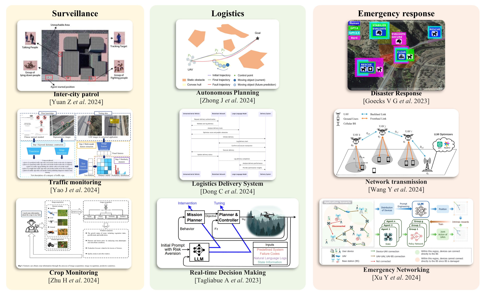

# 6  基于基础模型的无人机应用场景

本节重点关注将无人机（UAVs）与大规模语言模型（LLMs）结合的实际应用场景。大规模语言模型（LLMs）为多模态数据提供了先进的认知和分析能力，包括图像、音频、文本，甚至视频数据。与集成了传统机器学习算法的无人机相比，将大规模语言模型（LLMs）纳入无人机系统显著增强了它们的环境感知能力 [[408], [409]]，使得决策过程更加智能 [[410]]，并通过利用大规模语言模型（LLMs）在人与机器交互中的强理解能力来改善用户体验 [[344], [411]]。

根据现有文献，我们介绍了如图 [5] 所示的 FM 与 UAV 整合的典型工作：监视、物流和应急响应。这三个呈现的类别并不 exhaustive 于所有 UAV 应用，而是代表了 UAV 技术与先进模型能力结合的当前有效领域。它们专注于提升三个关键能力：环境感知、自主决策和人机交互。

### 6.1  监视

在监视方面，无人机被用于监测交通场景、城市环境和其他监管任务。传统的无人机监测应用方法主要依赖于机器学习技术。近年来，该领域进行了大量研究，包括车辆轨迹监测 [[412]]、道路状况监测 [[413], [414]]、路边单元 (RSUs) 通信 [[415]] 以及城市场景中的应用和管理 [[416]]。然而，H. Menouar  *等*  [[417]] 指出，无人机在智能交通系统 (ITS) 和智慧城市中预计将发挥重要作用，但其有效性将依赖于更大的自主性和自动化。同样，Wang L  *等*  [[418]] 强调了无人机在城市管理中的重要性，并突出了自动化和人机交互等挑战。 FMs 的出现最近引发了研究，探索 FMs 与 UAVs 的结合如何提升它们的可用性和任务性能。

在城市场景监测中，Yao J ​*et al*​. [[419]] 迅速部署了 VLMs，通过多模态学习和大规模预训练网络监测交通标志的状态，在准确性和成本效益方面都取得了优秀的成果。与 FMs 集成的 UAVs 在车辆检测、车辆分类、行人检测、自行车检测、速度估计和车辆计数等任务中表现卓越。Yuan Z ​*et al*​. [[420]] 提出了“巡逻代理”，该代理利用 VLMs 进行视觉信息获取，利用 LLMs 进行分析和决策。这使得 UAVs 能够自主进行城市巡逻、识别和跟踪任务。此外，与 LLMs 集成的 UAVs 在其他监测任务中也展示了出色的性能。在农业应用中，Zhu H ​*et al*​. [[421]] 提出使用 LLMs 和 VLMs 帮助农民提高生产力和产量。

### 6.2  物流

在物流领域，无人机（UAV）使整个物流链中的智能流程得以实现，从决策制定到路线规划和最终交付 [[422]]。无人机在物流和配送中的应用是当前研究的关键领域。Jiang H  *等*  [[423]] 使用先进的优化算法优化了无人机的调度和路线规划。Huang H  *等*  [[424]] 提出了涉及无人机和公共交通系统（如电车）的协作调度解决方案，证明其为 NP 完全问题。他们还引入了一种基于动态编程的精确算法来应对这一挑战。然而，无人机物流仍面临若干挑战。Wandelt S  *等*  [[425]] 确定了两个主要问题：自主导航与人机交互，以及实时数据分析。引入 FMs 提供了一种新的方法来应对这些挑战，通过 FMs 的推理和决策能力提升无人机的实时决策和规划能力。 此外，FMs 强大的理解能力提高了人机交互，提供了更好的用户体验。

针对使用 FMs 的物流应用，Tagliabue A  *等*  [[6]] 提出了一个名为 REAL 的框架，利用 LLMs 的先验知识并采用零次提示。这种方法显著提高了无人机的适应性和决策能力，改善了位置控制性能和实时任务决策能力。Luo S  *等*  [[426]] 利用 LLMs 处理用户提供的地址信息。由于传统方法在细粒度处理方面因用户输入缺乏精确性而面临挑战，他们对 LLMs 进行了微调，以解决这个问题，从而提高了无人机交付系统的自动化水平和处理效率。Zhong J  *等*  [[342]] 专注于自主无人机规划，提出了一个与 LLMs 集成的基于视觉的规划系统。该系统结合了动态障碍物跟踪和轨迹预测，以实现高效可靠的自主飞行。此外，集成 LLMs 增强了人机交互，改善了整体用户体验。Dong C ​ *等* ​。 [[427]] 从供应链的角度出发，提出了一种创新的无人机物流智能配送系统。通过整合区块链技术，他们确保了系统的安全性和透明性。此外，他们利用 LLMs 进行路线优化和动态任务管理，并通过自然语言交互提供客户支持服务，为未来开发安全高效的无人机配送系统提供了框架。

### 6.3  紧急响应

无人机在应急响应和灾难救援任务中具有固有优势 [[69]]。它们高度灵活的操作能力使其适用于大多数应急场景。金 W  *等*  [[428]] 分析了基于无人机的应急响应机制的需求，评估了灾难类型和无人机的性能特征，并提供了建议。通过配备不同的有效载荷和物资，无人机可以根据特定的灾难场景和任务要求提供定制化支持。戈克斯 V G  *等*  [[429]] 介绍了基于 LLM 的模型 DisasterResponse GPT，该模型利用上下文学习加速灾难响应，通过生成可行计划并实时快速更新和调整，从而实现快速决策。德库尔托 J  *等*  [[408]] 利用无人机提供即时视觉反馈和高数据吞吐量的能力，开发了一种场景理解模型，结合了 LLM 和 VLM。 这种方法以成本效益的方式增强了无人机实时决策能力，以处理复杂和动态的数据。此外，他们集成了多个传感器，以自主执行复杂任务。

除了救援任务外，无人机越来越多地被研究作为建立通信网络的工具，以应对灾区或偏远地区的连接挑战。这些网络支持依赖网络的任务和离线紧急响应。Fourati F  *等*  [[430]] 突出了人工智能在通信工程中的关键作用，包括流量预测和信道建模等应用。Xu Y  *等*  [[354]] 利用无人机作为移动接入点，以帮助城市通信系统在灾难场景中进行紧急网络部署。他们进一步采用 LLMs 来增强建模过程并加速优化工作流。Wang Y  *等*  [[431]] 使用结构化提示与 LLMs 优化无人机群的部署。与传统方法相比，他们的方法在确保强大的网络连接性和服务质量方面，通过精确的无人机定位降低了迭代次数。 LLM 驱动的框架简化了无人机网络运营商的操作挑战，为其在更复杂的现实场景中的应用铺平了道路。
