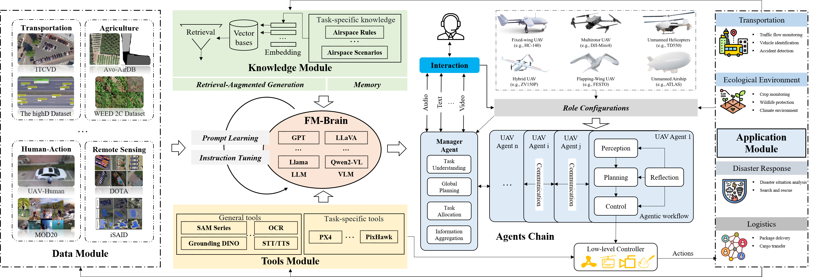

# 7  自主无人机：集成 FM 与无人机系统的通用流程

本节系统地探讨了 LLMs 和 VLMs 在传统无人机（UAV）管道和任务中的整合。从人工智能代理的角度，我们提出了一个代理无人机（Agentic UAV）的框架，该框架将基础模型（FMs）与无人机系统相结合，如图 [6] 所示。该框架包括五个关键组件：数据模块、知识模块、工具模块、基础模型模块和代理模块。数据模块专注于创建新数据集或将现有数据调整为适合于微调和训练特定于无人机任务的基础模型的格式。知识模块储存领域特定的信息，例如空域法规和场景库，这些信息对于无人机操作至关重要。工具模块包含满足无人机任务所需的领域特定工具或 API，从而扩展代理的解决问题能力。基础模型模块专注于微调基础模型，以提高其在无人机相关领域的适应性和性能。代理模块旨在创建包含感知、规划和行动的工作流程，以完成无人机任务。该模块还建立了反思机制，以根据任务执行的反馈优化过程。 此外，考虑到无人机群的频繁使用，代理模块集成了多代理设计、交互和通信单元。为了协调和管理这些代理，框架引入了一个管理代理，负责全球任务的规划和分配。以下各小节将详细阐述这些模块。

### 7.1  数据模块

数据模块专注于将与无人机（UAV）相关的数据转化为适合微调和训练针对无人机特定任务的语言模型（FMs）的对话或问答格式。无人机数据大体上可以分为由无人机生成的多模态传感器数据（例如，图像、视频、激光雷达、GPS、惯性测量单元）和操作员提供的自然语言指令。然而，原始数据集中常常缺乏自然语言指令，必须通过人工标注或自动化方法生成。

生成自然语言指令通常涉及利用图像描述模型或类似工具为传感器数据创建描述性或基于问题的注释，例如生成有关无人机图像中特定物体或事件的问题。先进的语言模型，如基于 GPT 的模型，进一步实现了多样化和上下文丰富的指令的自动生成，减少了对人工工作的依赖，并显著扩大了数据集构建的范围。这些方法确保自然语言指令与多模态数据相一致，促进了需要感知和推理的任务中语言模型的整合。

构建特定于无人机的数据库对模型的训练和微调至关重要。例如，已经开发了专门针对无人机导航和地理定位任务的基准数据集，如 Chu ​ *等人* ​[[388]] 提出的数据集，它通过文本-图像-边界框注释扩展了现有资源，以提高地理定位的准确性。同样，Yao ​ *等人* ​[[271]] 引入了一种细粒度的中文地址识别数据集，以支持无人机递送，提高城市环境中的导航精度。此外，在遥感应用中，无人机影像被广泛用于目标检测、语义分割和环境监测等任务，多模态大模型显著提高了任务的效率和准确性 [[432]]。

### 7.2  FM 模块

UAV 任务的 FM 模块关注两个核心方面：选择合适的模型和针对特定任务优化这些模型。这种模块化的方法确保 UAV 系统能够有效地处理多样化和复杂的场景，同时保持执行效率。

#### 7.2.1  模型选择

该过程始于识别任务类型，并确定数据是否涉及单模态或多模态输入。对于基于语言的任务，LLMs 如 ChatGPT 和 LLama 提供了推理、决策和自然语言交互的坚实基础。对于涉及视觉和语言数据的多模态任务，VLMs 如 GPT-4V、LLaVa 和 Qwen2-VL 通常是理想选择。这些模型作为基础组件，为智能代理提供了能力支撑。

除了基于语言和视觉的模型，最近的进展还探索了大型 3D 模型，这些模型与在 3D 环境中操作的无人驾驶飞行器（UAV）特别相关。这些模型结合了具有解释 3D 数据和规划任务能力的 FMs。例如，Hong  *等人*  [[433]] 提出了一个能够进行密集字幕生成、3D 问答和使用点云导航的 3D LLM。同样，Agent3D-Zero [[434]] 采用线集合提示（SoLP）来通过生成多样的观察视角来增强场景几何理解。虽然目前大多数研究集中在室内和封闭环境中，但将这些模型扩展到开放和动态的 UAV 场景中，展现了令人兴奋的未来机遇。

#### 7.2.2  模型优化

一旦选择了基础模型，就通过如指令微调和提示微调等方法进行优化和调整，以满足无人机特定的要求。提示微调是一种简单的方法，涉及创建任务特定的模板，将任务背景知识（如目标、环境特征和任务分解）嵌入模型的交互中。少样本学习可以通过使用精心策划的示例来补充这一过程，帮助模型理解任务特定目标。对于复杂挑战，例如多阶段规划或动态场景理解，链式思维方法 [[228]] 将任务分解为顺序子任务，从而改善推理和执行。

指令微调通过生成针对无人机特定任务的数据集提供了进一步的适应性。例如，在视觉语言导航（VLN）任务中，数据集可以包括与物体检测或无人机任务中的导航相关的问题-答案对。像低秩适应（LoRA）[[435]] 这样的技术通过仅微调一部分参数来优化这些模型，保持计算效率，同时提高性能。此外，层冻结技术可以保留预训练知识，并最小化对小型任务特定数据集的过拟合。

基于指令微调，来自人类反馈的强化学习（RLHF）[[436]] 增强了模型与人类偏好和操作需求的对齐。通过 incorporación 从人类反馈中派生的奖励信号，RLHF 使模型能够应对动态无人机挑战，例如路径生成、任务调整和关键物体检测。这种方法提高了无人机控制的实时响应能力和自动化水平，最终改善了任务效率和适应性。

### 7.3  知识模块

检索增强生成（RAG）是一项新兴技术，它集成了检索和生成的能力。其核心功能在于从知识库中检索相关信息，并将其与生成模型的输出融合，从而提高所生成结果的准确性和领域适应性。RAG 模型利用检索模块从外部知识库获取与输入内容相关的信息，并将其作为生成模块的上下文。这种方法提高了生成输出的质量和可靠性。与传统生成模型不同，RAG 引入了一种实时检索机制，以缓解“幻觉”问题，即模型因背景知识不足而生成不正确或虚构的信息。此外，RAG 的模块化架构允许知识库和生成模型的独立更新，从而增加系统灵活性，并确保生成中使用的信息的时效性和准确性。因此，RAG 在需要高度专业化、实时信息处理或个性化输出的任务中展现出显著潜力。

为 UAV 特定任务量身定制 RAG 系统至关重要，因为无人机操作涉及多样化和复杂的场景。首先，RAG 可以实时获取最新的环境数据，例如气象条件、地形信息和空中交通更新，这对于航班规划和导航等任务至关重要。其次，将特定领域的知识库整合到 RAG 框架中使无人机能够执行高级决策任务，比如在动态环境中进行自主任务调整或在监视任务中识别未知物体。最后，RAG 可以通过检索上下文数据来澄清查询或增强系统决策的可解释性，从而促进与人类操作员的互动。例如，在基于无人机的环境监测任务中，RAG 可以检索污染水平或土地使用模式的历史数据，将其与当前传感器数据结合，并生成综合报告。这些能力表明，一个构建良好的 RAG 框架如何提升无人机系统的效率、准确性和适应性，为更智能和自主的无人机应用铺平道路。

### 7.4  工具模块

工具模块旨在提供通用功能和特定任务能力，以支持无人机操作。

##### 一般工具

通用工具专注于广泛的多模态功能，以增强无人机系统的感知和互动能力。在这些工具中，视觉功能模型（VFM）作为解决多样视觉任务的基石，充分发挥其卓越的泛化能力和零样本学习能力。与强调推理和决策的基础模型（FM）不同，VFM 在理解特定视觉任务方面表现卓越，使其成为基础工具而非核心的“FM-大脑”组件。

VFMs 在无人机任务中提供了显著优势，能够与特定任务要求相匹配。例如，CLIP 系列因其强大的多模态对齐能力，非常适合物体识别和场景理解任务，能够实现开放词汇的物体检测和分类。因其零样本分割能力而闻名的 Segment Anything Model (SAM) 在各种环境和目标的图像分割方面表现理想。Grounding DINO 在物体检测和定位任务中表现出色，能够在动态场景中提供高效的目标跟踪和检测。这些模型可以独立处理特定任务，或者与 LLMs 或 VLMs 集成，以增强无人机系统在任务规划、导航和环境感知方面的智能。

此外，VFM 可以进行微调以适应无人机特定场景。例如，在专用数据集上微调 Grounding DINO 模型可以提高其在复杂多目标跟踪任务中的性能。此外，VFM 可以与传统机器学习或深度学习模型协作，形成“ 大模型 + 小模型 ”策略，以平衡泛化能力与任务特定效率。例如，VFM 提取全球语义信息，而较小的模型则专注于细微细节，从而实现全球分析与局部分析的有效结合。

VFMs 的另一个创新应用是用于生成针对 VLM 的指令微调数据集。通过利用 VFM 输出的图像标题、分割描述和物体深度信息，这些数据集可以用于训练针对 UAV 特定任务的 VLM。例如，Chen  *等人*  [[437]] 使用来自 VFMs 的互联网规模空间推理数据创建了一个 3D 空间指令微调数据集，训练了 SpatialVLM 模型。这种方法突显了 VFMs 在为大型模型生成高质量数据集方面的潜力，显著提升了 UAV 系统的动态感知和任务规划能力。

##### 任务特定工具

任务专用工具是针对无人机中心操作量身定制的，着重于飞行控制和任务执行。关键组件包括 PX4 和 Pixhawk，这些是广泛使用的开源飞行控制器。这些工具为无人机提供精确的控制、任务规划和实时适应能力，使其在复杂的空中任务中不可或缺。通过将这些专业工具与通用功能相结合，无人机系统在应对任务特定挑战方面实现了高度的灵活性和效率。

### 7.5  代理模块

代理模块旨在为无人机系统提供智能决策和任务执行能力。它整合了高层协调与任务特定的代理工作流程，以优化无人机在复杂任务中的操作。

##### 管理代理

管理代理负责无人机群内的高层任务协调和调度，确保多个无人机高效执行任务。该代理承担全球规划和整体任务分配的角色，将大型任务分解为更小的可管理子任务，然后分配给各个无人机。此外，全球代理监控无人机群的状态，并根据实时反馈动态调整任务分配，确保每个无人机在更广泛的任务背景下有效运行。

##### UAV 特定的代理工作流程

群中的每个无人机遵循一个自主的代理工作流程，该流程由一系列代理组成，旨在处理感知、规划和控制任务。这些代理依次操作，确保每个无人机有效处理必要的数据并执行其任务目标。感知代理首先处理传感器数据，使用先进的视觉基础模型（VFM）识别障碍物、物体和兴趣点，如用于物体识别的 CLIP、用于分割的 SAM 以及用于定位的 Grounding DINO。

接下来，规划代理从感知代理获取数据，以生成优化的飞行路径和任务策略，确保无人机能够有效地导航环境并完成指定任务。最后，控制代理将计划转化为可执行的指令，控制无人机的飞行和任务执行。

该工作流程允许每个无人机独立运行，同时也为整体任务目标做出贡献。此外，无人机特定的代理工作流程能够适应各种无人机任务，从搜索和救援到监视，通过根据每项任务的具体要求微调代理的能力。这种适应性增强了无人机在处理复杂动态环境中的效率。

##### 代理协作与适应性

全球代理与无人机特定代理之间的协作对于优化任务执行至关重要。全球代理提供指导整体任务策略的高层指令。这些指令被 Individual UAV 代理分解为详细的执行计划，确保每个无人机能够自主操作，同时为集体任务目标做出贡献。无人机代理与全球代理进行沟通，以接收更新的指令并报告进度，从而实现任务的持续适应及根据实时数据和变化条件对任务计划进行动态调整。

此外，群体中的无人机代理可以相互互动以交换信息和协调行动。这种点对点通信使无人机能够根据共享的情境意识调整其行为，例如在多个无人机必须避免碰撞或合作完成联合任务时。例如，一个无人机可能会与另一个无人机共享其感知数据，以调整飞行路径或实时同步任务。这种互动确保无人机群体协调运行，每个代理根据来自其他代理的全局指导和局部实时信息调整其行动。

## 8  结论

本文探讨了大型语言模型（LLMs）与无人机（UAVs）之间的有希望的整合，突显了 LLMs 在增强无人机的决策、感知和推理能力方面的变革潜力。文章首先提供了无人机系统组件的概述以及大型模型背后的原理，为其整合奠定基础。接着，我们回顾了基于基础 LLMs 增强的无人机系统的分类、研究进展和应用场景。此外，我们列出了支持智能无人机系统发展的关键无人机相关数据集。展望未来，我们强调了智能无人机的未来方向，其中多智能体系统集成知识和工具模块，以构建能够处理复杂任务和动态环境的灵活无人机。
