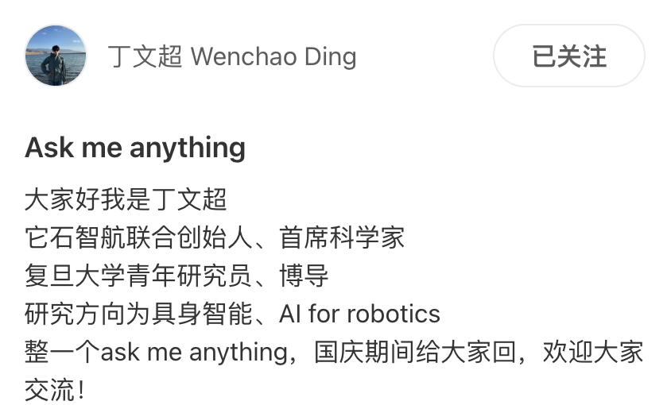

# 具身智能方向 Ask Me Anything

---

- 具身智能方向 Ask Me Anything 汇总！ - 微信公众平台
- [https://mp.weixin.qq.com/s/c3CGCcFggK5tVMq1Hm9ElQ](https://mp.weixin.qq.com/s/c3CGCcFggK5tVMq1Hm9ElQ)
- 2025-10-04 09:44

---

##### Datawhale干货 **整理：张文恺，Datawhale成员**

近期，Ask Me Anything 非常火爆。

前天，我们整理了，今天分享具身智能方向Ask Me Anything Part1。和大模型的一期相比，具身智能更像在襁褓之中的婴儿，等待着chatgpt时刻。

收录了许华哲、高飞、梁俊卫、周博宇、李永露、李弘扬、丁文超、陈思衡老师的精彩QA。其中，不仅有他们对具身智能学习，算法，工业落地的一些讨论、还包含了自身的研究经验、方向和对学术界VS工业界的见解，特别推荐一读。

 **“伯克利归国四子”之一、星海图联创、清华叉院助理教授**​ **许华哲**

Q：具身智能商业化落地有多大的可能性？

许华哲：100%！ 但是时间待定..

Q：许老师好! 老师我现在博一做人形机器人运控方向，但是我在纠结要不要一直做下去，因为目前运控还没有很落地，感觉去机器人公司也不能很持久哇，不知道老师您对这个研究方向有什么看法

许华哲：跳舞那种吗..我感觉这个是不是有点逐渐工程化了

Q：许老师 robotics方向有什么您经常follow的大佬可以推荐的吗

许华哲：Sergey

Q：许老师您好！我即将读博，导师是做robotic manipulation的。请问您看现在非learning-based的方法还有前景吗？导师的意思是，要从非learning的开始做，RL和VLA之类的没说一定不能做，但是优先级在后面。但是我看现在热点基本都是learning-based方法占领的，所以有点担心自己的前景。我之后是想去工业界，想听听许老师的意见，谢谢您

许华哲：非learning很有助于理解机器人问题，但我觉得learning未来比较大

Q：许老师您好，我今年phd刚入学，做具身智能（主要navigation）方向，因为年龄问题+个人规划未来更想进企业而非学术界，请问许老师按照您的经验整个phd过程是更多的出去实习好（当然也会兼顾论文发表），还是同样专注科研但是尽量多做一些比较好找工作的方向（但可能会缺少实习经验且不太好确定企业喜欢什么方向的phd）？想请老师解答

许华哲：我认为还是做高质量科研，在哪里其实不重要。企业可能卡和机器人多一点

Q：老师好，我从cs其他方向转到做vla，机器人学一窍不通，rl基础很弱，每天看着这个方向随时都有新论文出现（但可能很多都不太行），请问老师对如何在快速迭代的时代，能够follow住不掉队，提升学术品位有什么建议吗？以及感觉扎实的基础对深入研究非常重要，但总在被卷飞了的焦虑情绪中反复仰卧起坐，请问老师对弥补基础差距（看书看课这种方式）和实践中学习有什么建议么？

许华哲：其实看似进展很快，其实大多数都不是真进展，真的进展都是阶梯式出现的。

Q：老师，我想写论文，怎么才能写出高质量论文呢

许华哲：看看bill freeman的cvpr论文写作建议

Q：想请教老师 老师觉得meta learning和robotics 交叉有前景吗

许华哲：meta learning是个伟大的领域，但是至今还没看到特别厉害的paper！

Q：老师认为目前具身智能的瓶颈在哪里？

许华哲：数据和成功率

Q：想知道许老师怎么看待value based rl，似乎大家真正用RL解决问题总是ppo，而sac似乎只在real world rl上发挥作用，另一个问题是怎么看待value based rl的scaling呢

许华哲：因为仿真确实ppo可能就够了

Q：老师我是柔性电子博一在读，现在在做纯力学传感器的触觉感知相关工作，本科非cs科班只学习过西瓜书，您觉得后续应该多关注哪些算法去做这方面的工作（最近读了很多孙环波老师的工作）想问问老师还有哪些学者的相关研究值得关注

许华哲：wenzhen yuan，roberto calandra，ted adelson可以不

Q：刚入行，毕设在尝试做具身感知，多目标感知与导航规划，以模拟器复现、sim-to-real为主。请问许老师对这个方向的工作有推荐去学习的吗？比如bigai的MTU3D这样的工作

许华哲：vint的系列感觉也都挺值得看看的，但导航需要sim2real嘛，这个技术路线我不太确定

Q：许老师对vla和wm在具身智能的前景怎么看,两者是什么关系以及未来会相互融合吗

许华哲：我更看好vla一点，wm感觉难度更大上限更高

Q：想读博，又觉着自己菜得不行

A:读博就是思考自己哪里不菜的过程

Q：老师好，我是一名大二本科生正在做vla的科研，目前的任务是把pi0真机部署下，我有以下几个疑问1.目前是学完了深度学习的基础，和Transformer的理论与代码，但老实说看pi0的代码还是很吃力，有没有必要再深入的去看看多模态的相关工作（这方面有无推荐）2.组内（算是一个大的实验室）其实主要是做多模态的，其实我是第一批做具身的方向（导师也是青椒，但是很强）由于没有硕博前辈指导很迷茫，不知道以后科研该怎么做，其实我也不知道导师，硕博师兄在科研中起到的作用，所以难免对此感到焦虑，所以想问问老师你的看法

许华哲：我建议联系一些“圈子里”的朋友，可以是其他学校其他lab的，多去跟着讨论，可以一起合作，比自己憋着好多了

## 浙江大学长聘副教授、微分智飞创始人&CEO 高飞

Q：教授您好，我研一刚入学，方向是无人机，有点找不到学习的方向

高飞：多体智能，端到端控制，都还是蓝海

Q：高老师好！请问无人机追捕无人机目前还可以考虑哪些值得研究问题？

高飞：直接用marl来做

Q：高老师请问SLAM工业界还有搞头吗？

高飞：业界其实很缺资深的slam人才，但是对junior slamer岗位较少又不太友好

Q：老师觉得具身智能的技术路线五年内会收敛吗

高飞：用不了五年

Q：高老师多机器人研究有希望吗？感觉找不到工作了

高飞：还是要看兴趣。就业市场哪个方向热，真的很难提前几年预测。多机器人可能只是还没到时候

Q：教授您好，组里无人机主要是做改进结构改进算法，机械狗做一些深度强化学习做运动规划，我对两个兴趣都还可以，如果未来走就业的话哪个会更好一些

高飞：后者就业热度显著高

Q：老师您好，想问下在zju读博期间研究方向不是机器人，目前即将毕业但想重新研究机器人领域，有哪些推荐上手的方向呢。除了看论文寻找技术外，需要让实验室提供什么硬件支撑呢。您有没有什么好的建议

高飞：建议找有硬件的实验室支撑，机器人没有硬件平台还是太难开展

Q：高教授好，想问下教授怎么看待基于无人机的具身智能？相对于人形或其他形态的具身智能有什么落地的困难或者优势呢？

高飞：无人机本体结构比较成熟，但是敏捷小脑刚有初步发展，可拓展群脑刚起步，聪明大脑基本没有。正是发展具身智能的大好时机

Q：高教授，请问目前很多人觉得定位对机器人的作用越来越小，以后都是端到端智能导航，现在还有必要研究高精度位姿估计吗

高飞：比较成熟了，业界仍有需求，但是科研不好做了

Q：高老师我之前做过一段时间marl，对其应用前景有些迷茫，您认为未来learning based集群规划方法有可能在无人机集群上落地应用吗？感觉传统的优化、搜索等方法已经能很好的解决无人机集群的任务，在什么场景下learning的方法会强于传统的方法呢？

高飞：在not well formulated问题的决策上尤为重要

Q：高老师 将来机器人的方向到底是vla还是world model啊 vla是不是真的走不通了

高飞：端到端vla我比较悲观，但是vlm进入决策loop，让各种机器人有大脑能力，我认为是必然的

Q：高教授，目前做无人机端到端导航方向还有前景吗，我看已经有论文做到20m/s 的速度避障了，这方向还能继续做吗

高飞：实际上鲁棒性还有很大挑战

## 香港科技大学（广州）助理教授 梁俊卫

Q：老师您好，作为一名计算机研究生小白，该如何进入具身智能领域呢？未来想做vla➕rl方向，该如何进行论文复现和学习呢？现阶段只能做仿真，实验室已经准备采购宇树机器人，现在只有机械臂（但是还没有摸过）还是小白

梁俊卫：我其实觉得入门不要直接上vla，object navigation或者我们的social navigation方向比较容易入门，因为主要是仿真、RL，action space比较小。不需要懂机器人逆运动学URDF也能搞

Q：老师，对于搞纯CV的有什么好建议吗，个人是打算往LLM/VLM方向靠

梁俊卫：先从object navigation或者我们的social navigation开始，视觉+RL好入门

Q：想问问老师关于robomaster比赛怎么看，现在C9大二，我本身比较喜欢这个比赛，想要加学校的rm队，对具身也感兴趣，但是又想加入到科研中，怕时间安排不过来

梁俊卫：我现在招收的RA都拿过robomaster金牌的，这样能保证有硬件调试的基础。发paper的得是具身智能相关方向的

Q：梁老师，作为大咖，您平时关注哪些行业前辈？

梁俊卫：Chelsea Finn和王小龙

Q：本科生学机器人/具身智能，看哪三本书

梁俊卫：看书落后了，搜Embodied AI 斯坦福UCB的课或者tutorial，看最多star的

Q：老师，请问一下怎么样提高自己的科研taste呢～通过多看论文多思考吗

梁俊卫：捷径就是看领域内强组在做什么，比如我会看Chelsea Finn和王小龙他们在做啥

Q：想请问您，scene graph对于具身智能领域重要吗

梁俊卫：不重要，直接大模型推理，不需要认为构建数据表示

Q：求问 具身智能灵巧手目前训练数据采集有哪些方案？人的实操数据和灵巧手obs gap有多大

梁俊卫：一般都是遥操作收集灵巧手本体操作数据吧，遥操作方案挺多的

Q：梁老师好\~非常感谢您在评论区的回复，很受用！想问问如果我本科是传统CS的，错过了打RM的时间，之后又想做VLN+VLA，学习什么才能弥补上和robotic专业出身的同学的差距呢？

梁俊卫：差距主要体现在实机实验的时候吧，机器人的基础理论、机器人如何表示的、逆运动学、3D建模这些知识会用到

Q：老师，如何看待LLM和非LLM的learning方法在机器人应用上的边界？我始终觉得language不是机器人获取精细技能的必经之路，但业界貌似除了LLM就不好意思叫自己具身智能？

梁俊卫：现在VLA都是基于VLM后训练了，参考gr00T、pi0等，不是LLM。我觉得具身智能和传统自动化/机器人方向还是有区别的，主要是泛化性。目前来看，泛化性的能力必须要依赖多模态大模型。这是机器人操作方向的。而locomotion这些就是纯仿真RL的小模型，又不一样

Q：您觉得一个博士生一周应该投入多少有效工作时间呀

梁俊卫：我挺同意Karpathy说的，你能坚持每天8小时每周五天，四五年下来啥干不成。我觉得是博士是长跑,干科研规律性、持续性挺重要的。

Q：老师sim2real这一些gap如何解决有什么见解么

梁俊卫：目前我们还感觉是domain randomization魔法的阶段,没有系统性的解决办法，就是试

Q：老师您好，请问vla 和world model您觉得哪个前景更好，上限更高？

梁俊卫：不冲突，说不定结合才是做manipulation的终局

Q：老师好，很想请教您：（1）目前在做多模态大模型的理解/推理，请问能怎么朝具身智能上面靠吗？感觉迟早就是具身智能的天下。（2）只做多模态llm，将来能在具身智能企业找工作吗？就说我是做具身机器人的大脑？还是说得真的去做一些vla啥的？

梁俊卫：多模态大模型很有必要呀，建议看看gr00T、figure机器人他们的快慢系统架构，还有 pi0都是从VLM开始后训练出VLA的。一定要弄实机，就有竞争力了

Q：老师好，我想问一下研究生想走具身的话，需要什么基础呢？本科是cs的话

梁俊卫：可以从Isaac Lab的tutorial开始接触RL，或者从RLBench仿真/ALOHA真机开始接触模仿学习。这两个技术是目前比较重要的

Q：请问老师cv转什么方向合适 想往具身智能方向靠的话 未来想考虑就业

梁俊卫：cv转具身智能，可以从机器人导航入手，object navigation或者我们的social navigation，用强化学习。比机器人manipulation任务相对简单

Q：请问梁老师怎么看现在教职和工业界的选择呀。比如中上985的ap职位和大厂的人才计划。或者梁老师能分享一下您当时选择的心理历程嘛

梁俊卫：当时我只看到包裹的金额大小,唉，大厂里组和组之间差别很大的，所以建议去可能全职的组里实习一下才知道领导怎么样。ap就更难说了，进去之前你都不知道是什么情况的。我来科广也是闭眼玩家

Q：是更倾向于发领域内的顶会（ICRA IROS）；还是想发SR NC这种综合类的子刊大子刊？

梁俊卫：SR/NC还是顶中之顶的。具身智能的顶会目前比较公认的是CoRL/RSS/ICRA/IROS，CVPR/NeurIPS也看到有不错的工作。反正看Chelsea和王小龙他们发哪就对了

Q：梁老师您好，我今年在美国读研一，现在有两个方向可以选择，一个是传统机器学习的实验室，一个是ai driven drug discovery，哪个未来更有前景，我是要读博的。这两个都是去实验室做ra volunteer，大概率是留在做研究的实验室继续读博了。这对我非常重要，请您有空了帮我解答一下疑惑

梁俊卫：听起来drug discovery更有前景，现在都说要利用大模型搞这个，有可能有重大突破

Q：老师您认为现在AI phd还值得读吗，我的意思是说大模型现在这么火热，您感觉这一波风口能持续多久

梁俊卫：值得呀，AI里面有很多细分方向。你看现在还有多少人没有用上大模型，AI普及率还差很远

Q：感觉embodied ai现在也开始crowded了？很多课题组都在转，这个赛道是不是也红海了？

梁俊卫：说明这个领域开始火呀！众人拾柴火焰高。我挺看好的，下一个十年的事情

## 南方科技大学助理教授、微分智飞联创 周博宇

Q：老师现在做机器人的程序设计的话主要还是基于C代码吗？需要手动进行软硬件划分吗？现在硬件加速的需求大吗？

周博宇：c比较多，因为实时性要求高跑得快。算力特别紧张的情况下可能需要硬件加速

Q：周老师，请问无人机自主探索和绘图除了您们组还有那些实验室做的还不错的吗？

周博宇：南开张雪波老师组

Q：请问现有技术离机器人使用普通家庭厨房，即未改造的炉灶、厨具、冰箱、水槽等，完成做饭任务还有多远？技术难点在什么地方？

周博宇：多样复杂的场景下习得的技能难泛化 可靠性差

Q：老师好！想问一下如果和社科交叉的话，可以往哪个方向做呀

周博宇：机器人社会影响是个大问题

Q：作为力学学科的学生想问您这个行业有没有需要力学研究的地方

周博宇：有的，比如抗气流扰动，流体力学和控制的交叉

Q：周老师，请教一下，现在无人机定位还有什么可做的吗

周博宇：考虑一些难的场景，比如高速，高空，弱光

Q：周老师您好，我的研究方向是控制理论及在机器人中的应用，想跟您请教一下目前控制理论在您看来出路在哪里呢？目前还在确定research question中，希望能做出有独立性，创新性的工作，想问下您有什么建议吗？谢谢您

周博宇：找一些有实际意义的问题，比如无人机狭窄空间抗气流扰动，空中精准操作控制等等

Q：周老师您好，久仰大名！我即将读博，导师是做robotic manipulation的。请问您看现在非learning-based的方法还有前景吗？导师的意思是，要从非learning的开始做，RL和VLA之类的没说一定不能做，但是优先级在后面。但是我看现在热点基本都是learning-based方法占领的，所以有点担心自己的前景。我之后是想去工业界，想听听周老师的意见，谢谢

周博宇：刚入门从第一性原理做一遍有利于对manupulation问题更深入理解，而不是一上来啥都learn.那做manipulation和做其它DL问题也没区别。

Q：周老师好！请问你认为目前机器人与人互动的话题（如social navigation 打招呼等）在数据集方面有瓶颈吗

周博宇：互动确实是个问题。至于什么样的数据是瓶颈可能得先看痛点有哪些

Q：周博在VLN方向有没有一些比较看好的思路

周博宇：刚发布的 InternVLA N1效果看起来不错。

## 上交人工智能学院副教授、上海创智学院导师 李永露

Q：李老师您好，我本科大二钱班在读，想明年暑假进具身智能的组，现在的学习您有什么建议嘛！

李永露：可以参考我主页上的 recruit，里面有个 list、

Q：老师好！请问您如何看待机器人触觉模态数据在推动具身智能应用落地方面的价值呢？

李永露：刚需模态，未知实现形式，混乱的市场

Q：老师，具身现在最大的问题是什么，您觉得有什么解决方案，谢谢您

李永露：我觉得最大的是整个领域的可持续性发展问题，我觉得这是个长线的领域，怎么可持续，工业界和学术界都要解决

Q：thu 大一在读，想问下老师如果本科+phd之后ai赛道会饱和吗?mlsys/偏hpc的方向会不会好一点

李永露：物理 ai 应该还有蛮久，撑到你毕业应该还可以,不过也有一些不确定性就是现在 ai 发展是非线性的，你可以在后面的几年想一想，哪些科学问题是历史级别且需要花很久的，读博时候去那个方向就好了

Q：老师您好，想问下您认为当前vla结合机械臂落地最大的难点在哪

李永露：模型不够强，硬件没收敛

Q：老师请问具身智能这一块与语音或者音频模块结合比较紧密和比较能够落地的是什么方向呀

李永露：机器人需要和人聊啊 互动

Q：李老师您好！我即将读博，导师是做robotic manipulation的。请问您看现在非learning-based的方法还有前景吗？导师的意思是，要从非learning的开始做，RL和VLA之类的没说一定不能做，但是优先级在后面。但是我看现在热点基本都是learning-based方法占领的，所以有点担心自己的前景。我之后是想去工业界，想听听李老师的意见，谢谢您

李永露：好问题，打基础的话，还是要知道历史发展，既然做这个方向还是要学习实践classic 方法的。btw，其实没必要纠结所谓新旧，没意义，重要的是这个方向的核心问题及其上下文变没变，如果一个思路能前进，新旧不是理性的分析要素，执着于新和旧，火和不火，都不太是理性的选择。大模型带来的是语言视觉层面的泛化能力，这是毋庸置疑的，但是 planning 类的方法，现在真正玩真机的依旧要用的

Q：想请教一下：具身大模型会 一定是VLA嘛，我们希望机器人具备什么能力，做什么事情

李永露：vla 只是一个名词，准确点说可能你想问是不是 e2e 和数据 driven？我倒是挺看好 low level 能力靠 e2e 推动，应该有比较多的上升空间。我们需要机器人很多能力，粗糙可以分成 high和 low level 两大类，能想，会动，都有很多事可以做，我自己比较专注 low level，因为 high level 大概率取决于做通用多模态 llm 的人。

## 香港大学助理教授、港大OpenDriveLab团队负责人 李弘扬

Q：VLA和WA你看好哪个，VLA语言对驾驶真的有用吗

李弘扬：VLA我感觉没啥用。世界模型 WM？那还挺有用的。

Q：老师看好occupancy task在自动驾驶领域的发展么

李弘扬：没太大用

Q：老师! 纯软想入门具身智能，请问您有什么推荐的自学路径和开源项目吗

李弘扬：openvla, robotwin 这些来源项目都挺好

Q：李老师好，我想咨询一下老师，从具身这个领域的前沿探索者的角度出发，新入学的研究生(硕士)想投入到这样一个大的方向中，例如机械臂的抓取，应该如何规划自己

李弘扬：Scalable RL for Manipulation

Q：最近的vla模型有没有哪些比较厉害的值得详细研究的

李弘扬：PI\_0.5

## 它石智航联创、复旦大学青年研究员 丁文超

Q：对于中国家庭来说，人形机器人的恐怖谷效应是否会制约商业化的进度

丁文超：个人感觉不会，机器人商业化的瓶颈更可能是智能程度

Q：现在机器人能够做这么多复杂的动作，比如跳舞，用的是强化学习训练的吗？如果是的话，这些奖励函数怎么设计。还是用模仿学习做的

丁文超：一般是模仿+强化，模仿来实现styling，强化来实现balancing

Q：老师您好，我在另外一家机器人公司做机械臂传统运控，例如轨迹优化，轨迹插值，逆运动学高速求解，导纳控制这些，想问一下是不是后期还是得学VLA呢

丁文超：底层基本功也很重要，打好基本功。将来NN的东西学好了，也会用上。NN吐出来的规则也需要被精准可靠和smooth地执行。持续学习。

Q：丁老师，如何看待自动驾驶做RL的落地和瓶颈

丁文超：个人认为RL是自动驾驶技术栈最后几块拼图之一。RL依赖env dynamics，配合一段式端到端，就需要很强的world model。这一块还有一些技术开放性。

Q：现在机器人少样本学习能做到什么地步？

丁文超：现在具身还缺少很好的预训练（数据瓶颈，模型瓶颈），可以关注下Tars之后的release

Q：丁博，我今年刚毕业目前在自驾行业，像自驾在Robotaxi，l2辅助驾驶、物流小车很多方面都落地了，商业路线也比之前清晰很多了，具身智能感觉还是比较早期的蛮荒开拓阶段，走近个人消费者感觉还需要很多时间，在什么时候能真正实现商业闭环呢？

丁文超：自动驾驶早期也是争论颇多，但是一路走过来的：L2 vs L4；做软件还是软硬结合； 模块化还是NN化。具身时代比自动驾驶早期多了两把钥匙，1. 端到端的物理AI范式，2. 大模型大数据的scaling law。也会逐步收敛。

Q：具身这边之后的重点会是vla还是WM呢

丁文超：这两其实不冲突，就像硬币的两面：1. VLA是端到端模型的一种，将视觉（环境信息），语言（任务和场景理解）有效链接到动作，将来肯定需要持续改进（数据/模型/工程化等维度）； 2. WM解决的是用learning方法获得world dynamics，这样才能开启后训练的大门。

Q：对于机器人具体的任务/应用，例如manipulation, navigation和人形locomotion等等，哪类在业界的岗位更多、需求更大？前景怎么样

丁文超：一般来说，难而有价值的问题会需求量更大。这几个里面manipulation最难。当然，提的这几个任务后面会慢慢融合成一个system。

## 上交人工智能学院副教授 陈思衡

Q：你好，自动驾驶机器视觉是各个厂家都会有自己的模块，还是购买市场上通用的模块？哪家公司做自动驾驶视觉这块比较厉害？

陈思衡：做得好的还得靠自研。tesla应该是一骑绝尘吧

Q：陈老师你好，我是大三计算机学生，刚开始入手宇树人形机器人的项目，目标是让机器人学会拳击动作。但我没有什么头绪，网上也没有相关教程，我应该怎么做？

陈思衡：先搞台G1的机器，然后看看相关的paper，比如omnih2o，hover，asps等等，把这些方法都能在真机上复现出来

Q：陈老师，v2x方向到底可不可行，所谓的前中后融合路线之争有现实意义吗，真能上车用起来吗

陈思衡：我觉得技术上确实可行，商业上不符合当下主流，成本太高。但是十年之后，自动驾驶满街跑的时候，相互share信息是必然的

Q：未来的趋势是多传感器融合还是纯视觉？

陈思衡：我个人觉得是多传感器融合。因为很多传感器性能上限更高，会比人的双眼更加靠谱安全，同时，现在价格也比较便宜了。但是马斯克认为是纯视觉。通常，当我和马斯克意见不一致的时候，以相信马斯克为主

Q：老师怎么看待空间智能？现在大家都在做QA，感觉有点偏离本质...

陈思衡：我理解空间智能就是加点推理和交互元素的3D视觉。技术上没啥实质创新的时候，总归名字上搞点创新吧。科研嘛，总得推陈出新，给大家一些新鲜感。但是这个概念挺好的啊，自动驾驶，人形机器人，肯定都得有空间智能嘛。至于怎么搞，这个看你信什么。你要觉得硅基智能也得跟碳基智能类似，那可能应该多从视觉入手，找点视频，图像甚至3D图像 训个大视觉模型。因为很多动物不会语言，空间智能也非常强。你也可以觉得硅基智能不必跟碳基类似，上来就充分利用语言作为理解一切的基础，那么对标llm的发展路径 QA对也挺有道理。历史最终会给出对错。当下嘛，你信啥，你就搞啥

Q：请问陈老师如何看待如今一些大的科研成果诞生在企业而非高校呢？

陈思衡：个人觉得，就ai研究而言，传统高校显然面临着非常尴尬的境地，缺卡缺钱，再不调整机制设计 再不改革 就玩完儿了。同时，ai技术驱动的全学科科研范式革命不可遏制，虽然不一定会立马发生，但是在可预期的未来，会有巨大的转变

Q：无人驾驶真的可行可靠吗？

陈思衡：这个就像100年前 人们问交流电可行可靠么，一开始肯定不可行不可靠，但是eventually，肯定会可行可靠的

Q：老师您好，您觉得像VLA这种端到端的方法在工业界有前景吗，好像目前的应用场景都是target 家用机械臂这种。对于四足或者人形机器人，类似VLA的learning-based method可以实现具身智能吗，还是说目前只是在做research比较有价值，真正离工业届还很远？

陈思衡：VLA属于具身也不知道咋搞，那就先照着大模型搞着再说嘛，反正短期之内无法证伪。人形的话 采集大量高质的遥操和动捕数据代价太大，于是主要一时之间很难用上VLA。overall来说 用什么方法还是跟有什么样的数据相关联的
